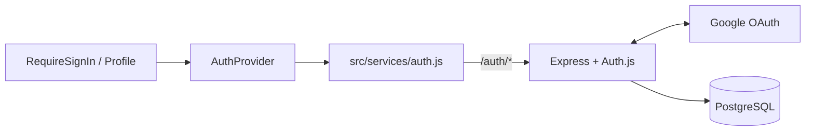

# Authentication Guide

Last updated: 2026-07-06

The app now uses Google OAuth 2.0 through Auth.js as the only real sign-in path. The older dashboard button and fake email/password auth UI are no longer part of the live route flow.

## Live Flow

Current runtime behavior:

1. `AuthProvider` loads `/auth/session` when the SPA starts.
2. Protected routes render `RequireSignIn` when there is no authenticated user.
3. The chalkboard auth button calls `signIn()` from `AuthProvider`.
4. `src/services/auth.js` requests `/auth/csrf` and submits a form to `/auth/signin/google`.
5. Auth.js redirects the browser to Google.
6. Google returns to `/auth/callback/google`.
7. Auth.js validates the callback, persists/loads the user through PostgreSQL, and creates a database-backed session.
8. The browser returns to the requested application URL with an HTTP-only session cookie.
9. On the first authenticated product API request, the server creates or updates the corresponding row in the app's `users` table using the Google session email and name.

## Frontend Files

| File | Responsibility |
| --- | --- |
| `src/App.jsx` | Mounts `/` and `/profile` routes |
| `src/components/AuthProvider.jsx` | Shared auth state and actions |
| `src/components/RequireSignIn.jsx` | Chalkboard Google sign-in gate |
| `src/pages/Profile.jsx` | Signed-in profile surface |
| `src/services/auth.js` | Session/CSRF/sign-in/sign-out client helpers |

## Backend Files

| File | Responsibility |
| --- | --- |
| `app.js` | Mounts Auth.js at `/auth/*` |
| `server/auth.js` | Configures Google provider, sessions, and adapter |
| `server/middlewares/requireAuth.js` | Protects authenticated API endpoints |
| `server/models/auth-adapter.js` | PostgreSQL adapter for Auth.js |
| `server/models/migrations/001_auth.sql` | Auth schema |
| `scripts/db/schema.sql` | Product schema used by session-protected documents/users/trash routes |

## Requirements To Work End-To-End

- Docker Desktop / PostgreSQL running
- `npm run db:migrate` completed
- `.env` values for:
  - `APP_ORIGIN`
  - `DATABASE_URL`
  - `GOOGLE_OAUTH_CLIENT_ID`
  - `GOOGLE_OAUTH_CLIENT_SECRET`
  - `AUTH_SECRET`
- Google OAuth app configured with the local origin and callback URL

## Current Constraints

- Auth is Google-only; there is no password login or signup flow.
- The frontend auth page styling is custom, but the identity/session source of truth is Auth.js plus PostgreSQL.
- If PostgreSQL or OAuth config is missing, the auth page can render but sign-in cannot complete.
- Product APIs are now session-aware. Anonymous requests to `/api/users/*`, `/api/documents/*`, `/api/trash/*`, and `/api/me` return `401 Authentication required`.
