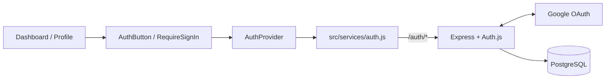

# Authentication Guide

The app uses Google OAuth 2.0 through Auth.js. Visitors can view public pages,
but protected pages and features redirect anonymous users to Google sign-in.
The first sign-in creates a local PostgreSQL user and later sign-ins reuse it.
There is no password-based registration or login.

## How it connects



The browser never receives `GOOGLE_OAUTH_CLIENT_SECRET` or `AUTH_SECRET`.
Express performs the Google code exchange, and Auth.js stores the session in an
HTTP-only cookie backed by PostgreSQL.

## Authentication flow

1. `AuthProvider` requests `/auth/session` when the SPA loads.
2. Anonymous users can view `/`; `AuthButton` displays **Sign in with Google**.
3. Clicking the button calls `signIn()` from `AuthProvider`.
4. `AuthProvider` calls `signInWithGoogle()` from `src/services/auth.js`.
5. The service requests `/auth/csrf`, then submits a form to
   `/auth/signin/google`. A form submission is used so the browser performs a
   full-page navigation.
6. Express sends the request to Auth.js, which creates the Google authorization
   URL and redirects the browser to Google's login or account-selection page.
7. After Google authenticates the user, it returns the browser to
   `/auth/callback/google`.
8. Auth.js validates the callback, creates or finds the local user through the
   PostgreSQL adapter, and creates a database session.
9. The browser receives an HTTP-only session cookie and returns to the requested
   page.
10. Signing out submits another CSRF-protected form. Auth.js deletes the database
    session, expires the cookie, and returns the browser to `/`.

Only verified Google email addresses are accepted. Google access, refresh, and
ID tokens are not stored.

## How Auth.js works

Auth.js is the library that controls the OAuth workflow. `app.js` mounts it at
`/auth/*`, while `server/auth.js` gives it the Google configuration and the
PostgreSQL adapter.

When a user signs in, Auth.js:

1. Creates `/auth/csrf`, then checks that token when the browser posts to
   `/auth/signin/google`.
2. Builds Google's authorization URL with PKCE, state, and nonce values. These
   values connect the Google response to the same browser and sign-in request.
3. Redirects the browser to Google. Google returns an authorization code to
   `/auth/callback/google`, where Auth.js checks those values and exchanges the
   code for verified Google profile information.
4. Calls `getUserByAccount()` and `getUserByEmail()` on the adapter. For a new
   user, it then calls `createUser()`, `linkAccount()`, and `createSession()`;
   returning users reuse their existing account and receive a new session.
5. Sends the raw session token in an HTTP-only cookie. The adapter stores only
   its SHA-256 hash in PostgreSQL, and later `/auth/session` requests use it to
   load the user.

Auth.js is the only runtime code that calls the adapter methods, e.g., `adapter.createUser(user)`. React
components, Express routes, and middleware never call the adapter directly.
After validating Google, Auth.js chooses the required operation, and
`auth-adapter.js` translates it into PostgreSQL queries.

### CSRF request guard

A CSRF token acts like an API guard for actions such as sign-in and sign-out. It
proves that the request was intentionally started through this application, not
submitted by another website using the browser's cookies. Auth.js creates and
checks this token automatically. This is different from `requireAuth`, which
checks whether the user is signed in.

## Auth.js files and sign-in use case

```text
Files that set up Auth.js

package.json
    └── installs @auth/express

server/models/auth-adapter.js
    └── provides PostgreSQL operations
         │
         ▼
server/auth.js
    └── configures Google, sessions, and the adapter
         │
         ▼
app.js ◄── server/middlewares/requireAuth.js checks the request origin
    └── mounts ExpressAuth(authConfig) at /auth/*


Use case: user clicks "Sign in with Google"

src/components/AuthButton.jsx
    │ calls signIn()
    ▼
src/components/AuthProvider.jsx
    │ manages authentication state
    ▼
src/services/auth.js
    │ posts to /auth/signin/google
    ▼
app.js / Auth.js
    │ redirects the browser
    ▼
Google login page
    │ returns to /auth/callback/google
    ▼
app.js / Auth.js
    ├── calls auth-adapter.js ──► PostgreSQL
    └── sends an HTTP-only session cookie ──► Browser
```

`AuthButton.jsx` is one use case of Auth.js: clicking the button eventually
reaches the built-in `/auth/signin/google` endpoint mounted by `app.js`.

The browser never receives `GOOGLE_OAUTH_CLIENT_SECRET` or `AUTH_SECRET`.
Express performs the Google code exchange, and Auth.js stores the session in an
HTTP-only cookie backed by PostgreSQL.

## Main files

| File | Responsibility |
| --- | --- |
| `src/App.jsx` | Defines the public `/` and protected `/profile` SPA routes. |
| `src/components/AuthProvider.jsx` | React application’s shared authentication manager. Exposes the current `user`, `signIn()`, and `signOut()` to React components. |
| `src/components/AuthButton.jsx` | Reusable dashboard control that shows **Sign in** or the user's profile icon. |
| `src/components/RequireSignIn.jsx` | Requires a signed-in user; otherwise starts Google sign-in and returns them to the requested page. |
| `src/pages/Profile.jsx` | Displays profile information and the sign-out button. |
| `src/services/auth.js` | Auth API service - Calls the Auth.js session, CSRF, sign-in, and sign-out endpoints. |
| `app.js` | Mounts Auth.js at `/auth/*` and applies the authentication security middleware. |
| `server/auth.js` | Configures Google OAuth, sessions, callbacks, and the PostgreSQL adapter. |
| `server/middlewares/requireAuth.js` | Loads sessions and rejects unauthenticated API requests. |
| `server/models/auth-adapter.js` | Stores users, Google account links, and sessions in PostgreSQL. |
| `server/models/migrations/001_auth.sql` | Defines the authentication tables. |
| `compose.yaml` | Runs PostgreSQL locally for the Alpha stage. |


## To integrate authentication in new features

Render the shared dashboard control:

```jsx
import AuthButton from '../components/AuthButton.jsx';

<AuthButton />
```

Wrap protected page content with `RequireSignIn`, following
`src/pages/Profile.jsx`. Anonymous users will sign in and return to that route.

Protect an Express endpoint in this order:

```js
router.get('/example', loadAuthSession, requireAuth, handler);
```

Read the authenticated user from `res.locals.session.user`; never trust a user
ID supplied by the browser.

## Local setup

For the Alpha stage, PostgreSQL runs locally through Docker Compose. DigitalOcean
is the Final deployment target and is not part of the current local environment.

Requirements to run:

- Node.js 22.13.0 or newer and npm.
- Docker Desktop running with Docker Compose.
- Ports `5173`, `3001`, and `5432` available.
- `.env` must contain the OAuth credentials, AUTH_SECRET, and matching DATABASE_URL.
- A Google account listed as an OAuth test user while the consent screen is in
  testing mode.

On the first checkout, run:

```bash
npm install
npm run db:up
npm run db:migrate
npm run dev
```

- `npm run db:up` starts the local PostgreSQL container defined in
  `compose.yaml`.
- `npm run db:migrate` runs `scripts/migrate-auth.js`, which applies
  `server/models/migrations/001_auth.sql` to create the authentication tables
  and indexes.

Open `http://localhost:5173`. The migration is safe to run again.

The Google Web OAuth client must allow:

- JavaScript origin: `http://localhost:5173`
- Redirect URI: `http://localhost:5173/auth/callback/google`

The server uses these environment variables:

| Variable | Purpose |
| --- | --- |
| `APP_ORIGIN` | Browser-facing application origin. |
| `DATABASE_URL` | PostgreSQL connection string. |
| `GOOGLE_OAUTH_CLIENT_ID` | Google Web OAuth client ID. |
| `GOOGLE_OAUTH_CLIENT_SECRET` | Google Web OAuth client secret. |
| `AUTH_SECRET` | Stable Auth.js secret of at least 32 characters. |

## Local database storage

Docker stores PostgreSQL data in the named `postgres_data` volume, normally
created as `project-thesis-rewriter_postgres_data`. Each teammate has a separate
volume and separate local users and sessions.

`npm run db:down` stops the containers but preserves the data. Running
`docker compose down --volumes` deletes the volume and all local authentication
data.
