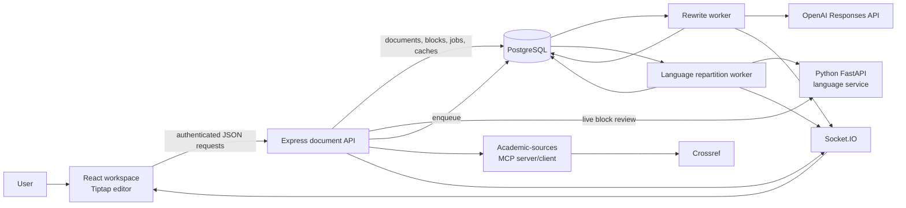
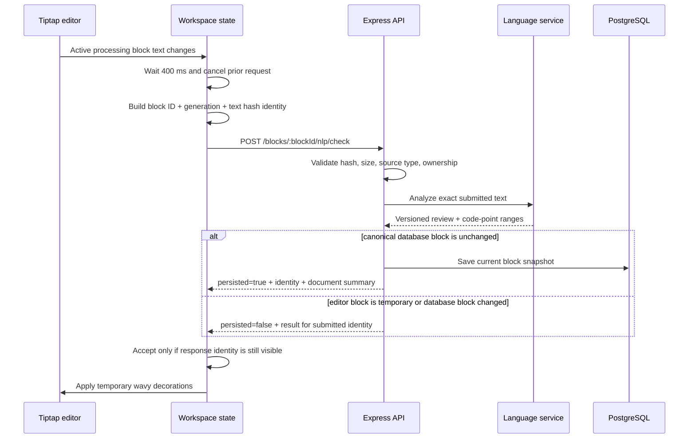
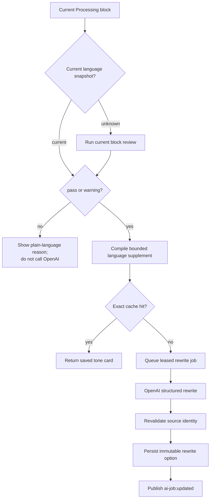
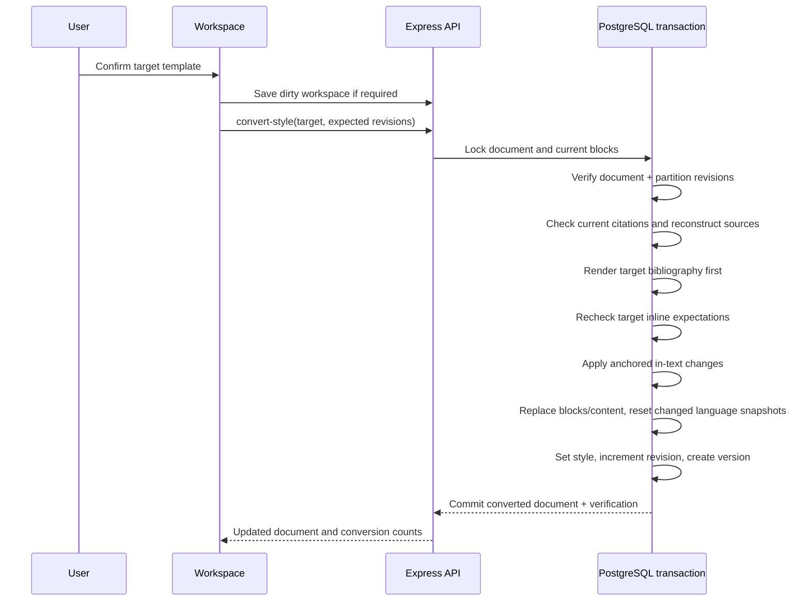

# NLP, AI, and MCP Cool-Factor Upgrades

Implementation report for `feature/final/AI-NLP-cool-factors-attempting`

Date: July 26, 2026

## 1. Purpose and relationship to the earlier report

This report documents the current language-review, AI-writing, citation, MCP, data, and user-interface upgrades built on top of the final UI/UX architecture described in `docs/final/existing-UI-UX-upgrades.md`.

The earlier report remains the baseline for document import, the editor, block lifecycle, saving, version history, subscriptions, responsive layout, and the original AI workflows. This report focuses on the newer cross-cutting implementation:

- automatic language review for every current writing block;
- semantic sentence grouping and safe document repartitioning;
- language-aware AI analysis, practice, and rewriting;
- deterministic citation-list reconstruction and in-text citation checking;
- MCP-backed academic-source search, reference parsing, and citation rendering;
- atomic APA, MLA, and Chicago template conversion;
- exact revision, block, and text identities across the browser, Express API, background workers, Python service, database, OpenAI, and Crossref;
- user-facing cards, controls, issue decorations, approval actions, and owl animation behavior.

Although this report uses technical terms such as NLP in architecture descriptions, the product UI deliberately translates those terms into plain language. Users see labels such as **Automatic language review**, **Sentence grouping**, **Sentence connection level**, **Writing checks**, and **Main ideas in this block**.

## 2. Executive summary

The upgrade changes the application from a block editor with independent AI actions into a versioned document-intelligence pipeline.

The important architectural result is that no asynchronous result is trusted merely because it refers to the same document or block ID. A result is current only when its complete identity still matches:

```text
document
+ document revision
+ partition revision
+ block ID
+ block partition generation
+ source-text hash
+ pipeline/prompt/renderer version
+ relevant preference or language-snapshot fingerprint
```

This identity model solves the most serious failure modes found during testing:

- an edited or newly split block no longer receives a result generated for its old text;
- a temporary editor block can still be reviewed before it has been saved as a canonical database block;
- skipped headings and test sentences no longer enter the argumentative-writing AI path;
- stale analysis is not displayed as a current result;
- stale citation replacements fail closed instead of editing the wrong characters;
- background rewrite prewarming does not impersonate a visible user request;
- visible `Processing...` rewrite cards and owl thinking animation use the same front-end predicate;
- a template switch cannot partially convert only the reference list or only the in-text citations.

The system combines deterministic code and probabilistic services according to risk:

- deterministic code owns identity, offsets, validation, caching, transaction boundaries, status transitions, reference matching, patch application, and all final document mutations;
- the Python language service supplies linguistic diagnostics and semantic grouping;
- OpenAI supplies structured analysis, coaching, and rewrite candidates but never directly edits the document;
- the academic-sources MCP server exposes narrow, read-only tools for Crossref lookup/search, reference parsing, and citation rendering;
- every document-changing citation or rewrite action remains an explicit, versioned application operation.

## 3. Current system architecture

### 3.1 Component view



### 3.2 Responsibilities

| Layer | Main responsibility |
| --- | --- |
| React workspace | Editing, current selection, request cancellation, identity checks, cards, issue decorations, confirmations, user approvals, and responsive behavior |
| Express API | Authentication, ownership, input contracts, orchestration, safe public errors, revisions, persistence, and event publication |
| PostgreSQL | Canonical document/block state, versions, current language snapshots, jobs, leases, AI caches, and citation workflow caches |
| Python language service | Sentence boundaries, grammar/spelling signals, semantic representations, block status, topic terms, coherence, and contiguous partition candidates |
| Rewrite and repartition workers | Durable asynchronous execution, leases, retries, stale-context checks, and result publication |
| OpenAI | Schema-constrained block analysis, rewrite candidates, and practice feedback |
| Academic-sources MCP | Small read-only tools for source lookup, search, parsing, and style rendering |
| Crossref | External bibliographic metadata candidate provider |
| Socket.IO | Authenticated document-scoped status and result notifications |

### 3.3 Why the language service is separate

The Node application remains the source of truth for authorization and mutations. Linguistic processing runs behind a small Python FastAPI boundary because its model ecosystem and numerical tooling are better suited to sentence parsing and semantic comparison.

The service exposes only three operations:

| Endpoint | Purpose |
| --- | --- |
| `GET /health` | Report pipeline and dependency versions |
| `POST /v1/analyze-block` | Review one temporary or persisted text block |
| `POST /v1/partition-document` | Return contiguous semantic block candidates |

The service cannot access user sessions, edit the database, apply a rewrite, or mutate a document. It receives the minimum text required for the operation and returns a versioned data object to Express.

### 3.4 Versioned runtime components

The current implementation pins its major processing identities:

| Component | Version |
| --- | --- |
| Language pipeline | `document-nlp-v1` |
| Language contract | `nlp-contract-v1` |
| Partition algorithm | `contiguous-semantic-v1` |
| Known-term rules | `known-terms-v1` |
| Grammar rules | `thesis-grammar-rules-v1` |
| spaCy model | `en_core_web_sm==3.8.0` |
| Embedding model | `sentence-transformers/all-MiniLM-L6-v2@v1.0` |
| Language-to-rewrite compiler | `nlp-rewrite-supplement-v1` |
| Citation workflow | `citation-workflow-v4` |
| Citation renderer | `citation-renderer-v2` |

These versions are part of cache and validity decisions. A deployment that changes processing behavior cannot silently reuse results generated by an incompatible pipeline.

## 4. Language-review contracts and data flow

### 4.1 Block result contract

A reviewed block returns:

- the SHA-256 hash of the exact source text;
- pipeline and contract versions;
- one of `pass`, `warning`, `blocked`, or `skipped`;
- reason codes explaining structural or review decisions;
- temporary sentence ranges using Unicode code-point offsets;
- issue ranges, severity, message, original text, suggestion, and confidence;
- entities, noun chunks, and topic terms;
- semantic coherence and a representative semantic anchor;
- issue counts and sentence count;
- a `rewriteEligible` decision;
- degraded-mode and warning indicators.

`unknown` is also a persisted block state. It means the application does not hold a current review for the exact text and pipeline.

### 4.2 Why sentence records are temporary

The language service identifies sentence ranges, but the database does not create a permanent sentence table. Sentences change too frequently during editing to be stable domain entities.

Instead:

- the block remains the durable unit of editing, analysis, rewriting, completion, and versioning;
- sentence ranges are derived from the current block text;
- ranges use code-point offsets rather than JavaScript UTF-16 indices;
- the text hash and partition generation determine whether those ranges still apply.

This avoids orphaned sentence records and prevents emoji or other non-BMP characters from shifting an issue or citation anchor.

### 4.3 Live review flow



The browser aborts the previous request when the active block, generation, or text changes. It also compares the returned identity with the identity currently visible before changing cards or editor decorations.

The server supports two safe cases:

1. **Canonical case.** The block exists and still has the submitted hash and partition generation. The result is persisted and included in the document summary.
2. **Temporary case.** A split or unsaved editor block is not yet in PostgreSQL, or its canonical context moved while the request was running. The result is returned for display but is not written onto a different block.

This temporary path is what prevents `Document block not found` from breaking review immediately after a title is split away from body text.

### 4.4 Issue presentation and rejection

Review issues are rendered by `NlpIssueDecorationPlugin` as temporary ProseMirror decorations. They:

- do not alter the document text;
- do not enter the editor undo history;
- use code-point-to-editor-position conversion;
- expose a tooltip and accessible note;
- are refreshed or removed when the identity changes.

Each suggestion has an explicit reject action. Rejection identity includes the issue code, start and end offsets, original text, and proposed replacement. A persisted rejection is allowed only while the block hash and partition generation remain current. Rejected issues are removed from visible counts and eligibility is recalculated from the remaining issues.

The user can therefore disagree with a diagnostic without silently changing their writing.

### 4.5 Status calculation

The block language states have different meanings:

| State | Meaning | AI rewrite eligibility |
| --- | --- | --- |
| `unknown` | No current result for this exact text/version | No |
| `pass` | No blocking issue found | Yes |
| `warning` | Review suggestions exist, but the block is usable | Yes |
| `blocked` | Structural or severe integrity problem | No |
| `skipped` | Non-argumentative or intentionally excluded content | No |

The application does not convert a degraded local fallback into a false clean pass. When the remote service is unavailable and fail-open mode is enabled, deterministic local review can keep the workflow usable, but the snapshot remains visibly degraded and is at least a warning.

### 4.6 Structural skip logic

Skip decisions cover content that should not be sent through argumentative analysis or rewriting:

- titles, subtitles, headings, and pseudo-headings;
- bibliography headings and reference entries;
- isolated names, course information, dates, and cover-page lines;
- low-information test strings such as `Hello world` and `This is a new line`;
- generic image-description fragments;
- OCR or truncation artifacts;
- incomplete, extremely short fragments with no meaningful academic signal.

The partitioner can isolate these units even when a title and body initially arrive in the same imported paragraph. Source type, paragraph boundaries, sentence form, lexical signals, and semantic discontinuity all contribute to the boundary decision.

### 4.7 Deterministic local fallback

The Node client protects the application from language-service downtime:

- health timeout defaults to 1.5 seconds;
- block review timeout defaults to 8 seconds;
- document partition timeout defaults to 45 seconds;
- active identical requests are deduplicated in memory;
- returned data is validated with Zod;
- source hash and pipeline version must match;
- `NLP_FAIL_OPEN=true` enables a deterministic local fallback;
- public failures use safe codes rather than provider stack traces.

Local fallback checks include obvious spelling errors, incomplete sentences, mismatched delimiters, missing terminal punctuation, low-information lines, and structural skip signals. Its semantic vector is deterministic so that the fallback remains testable.

## 5. Semantic sentence grouping and repartitioning

### 5.1 User-facing profiles

The sidebar presents the feature as **Sentence grouping**, not as a mathematical similarity threshold.

| UI label | Stored profile | Behavior |
| --- | --- | --- |
| Broad | `low` | Keeps larger related passages together |
| Balanced | `medium` | Middle-sized coaching blocks |
| Focused | `high` | Splits more readily at topic changes |

The control is a card-style custom trigger consistent with the other workspace controls. This prevents native `<select>` option styling from varying by browser and operating system.

### 5.2 Partition invariants

The partition algorithm must satisfy all of the following:

1. Every source code point belongs to exactly one output candidate.
2. Candidates are ordered and contiguous.
3. No text is inserted, removed, or silently normalized.
4. Structural skipped units are isolated.
5. Oversized candidates are split at the safest available sentence boundary.
6. Semantic similarity controls grouping only after structural rules.
7. The returned pipeline/profile identity matches the request.

Express reconstructs the candidate stream and checks it against the original before it accepts a partition result.

### 5.3 Repartition job flow

```mermaid
sequenceDiagram
    participant W as Workspace
    participant A as Express API
    participant D as PostgreSQL
    participant J as Repartition worker
    participant L as Language service
    participant R as Realtime

    W->>A: Repartition(profile, expected revision, expected partition revision)
    A->>D: Insert one active document_nlp_job
    A-->>W: 202 queued job
    J->>D: Claim with FOR UPDATE SKIP LOCKED + lease
    J->>D: Read and verify source revisions
    J->>L: Partition exact document candidates
    L-->>J: Contiguous candidate stream
    J->>J: Verify lossless reconstruction and map identities
    J->>D: Recheck revisions and atomically replace blocks
    J->>D: Increment document and partition revisions; create version
    J->>R: document:nlp-status
    R-->>W: Completed/degraded/failed status
```

Only one queued or running language job may exist per document. A worker claims work with `FOR UPDATE SKIP LOCKED`, records a lease owner and expiration, and can safely recover abandoned work.

Before writing, the worker checks the document revision and partition revision again. If the user edited the document during language processing, the job is cancelled as a conflict rather than overwriting newer work.

### 5.4 Block identity after a split or merge

Repartitioning does not assign every block a random new identity.

The mapper compares old and new paragraph intervals:

- an unchanged exact interval keeps its block ID and partition generation;
- a changed interval inherits the best-overlapping prior identity;
- a changed boundary increments the highest relevant partition generation;
- new unmatched candidates receive new IDs;
- downstream caches that include generation cannot reuse a result from the prior boundary.

This preserves continuity where it is safe while invalidating results where the text unit actually changed.

### 5.5 Caret and active-block restoration

The request may include the active block ID and absolute caret offset. Because repartitioning is expressed as a lossless contiguous mapping of the same document text, the editor can relocate the selection after the new blocks arrive instead of jumping to an unrelated location.

## 6. Language-aware AI workflows

### 6.1 One readiness rule across modes

The three right-panel modes remain:

- Analyzing;
- Practicing;
- Rewriting.

They now share current block identity and language readiness:

- skipped content does not enter an argumentative workflow;
- blocked or unknown language state cannot silently enter rewriting;
- analysis and practice caches include the block boundary generation;
- a text edit invalidates the visible result even when the block ID is unchanged.

### 6.2 Analysis flow

Block analysis uses a schema-constrained OpenAI response. It receives:

- exactly one selected block;
- the immediate neighboring context needed to judge local flow;
- deterministic document/block identity;
- selected analysis filters;
- the current language snapshot fingerprint;
- narrowly scoped academic metadata when a DOI lookup succeeds.

The prompt asks for observations about clarity, conciseness, academic style, and flow. It prohibits inventing evidence, changing the user's text, or presenting external metadata as proof that the writing is factually correct.

The cache key includes:

```text
document ID
+ block ID
+ source-text hash
+ partition generation
+ filter signature
+ language-snapshot fingerprint
+ model
+ prompt version
```

This resolves the prior condition where a card could show `Not reviewed` or retain an analysis created for an earlier block shape.

### 6.3 Rewrite eligibility and prompt supplement

The deterministic compiler converts only a small, safe part of the current language result into rewrite instructions:

- at most three high-confidence spelling corrections;
- up to four high-confidence topic terms from the semantic anchor;
- no raw internal diagnostic payload;
- no stale or blocked snapshot.

The supplement receives its own fingerprint. That fingerprint is appended to the effective rewrite prompt version and stored with the rewrite option and job.

The rewrite cache key therefore distinguishes:

```text
same text + same tone + different current language advice
```

as two different requests.

### 6.4 Rewrite request and prewarm flow



Opening the rewrite workflow prewarms a bounded forward window:

- six eligible blocks under default preferences;
- three eligible blocks when custom writing preferences create more expensive, preference-specific cache entries;
- at most twenty following blocks are scanned to find eligible candidates.

Prewarming is a cache optimization. It does not make the hidden owl animate and does not display a hidden block as a visible request.

### 6.5 Rewrite worker safety

The worker:

- claims queued work with a database lease;
- uses a default concurrency of two;
- retries only transient rate-limit or timeout failures;
- revalidates block text, partition generation, prompt identity, and language supplement before persistence;
- stores safe error codes;
- publishes job state without exposing provider internals.

The generated option includes rewritten text, explanation, changes, warnings, and an explicit meaning-preservation decision. Applying it remains a separate user action and creates normal document/version state.

### 6.6 Visible processing and owl animation

The front end centralizes rewrite visual state in two pure functions:

- `rewriteCardShowsProcessing(card, currentBlock)`;
- `shouldAnimateWorkspaceOwl(context)`.

A card shows `Processing...` when:

- its tone is queued or running; or
- it is an automatic cache miss for an eligible, non-manually-edited, non-skipped block.

The owl thinks when:

- an explicit visible request is loading; or
- the visible desktop/mobile rewrite panel contains at least one card that uses the same processing predicate.

The owl stops for completion, failure, a hidden panel, an NLP-ineligible block, or background-only prewarming. Binding both UI elements to the same state removes the contradictory state where a card said `Processing...` while the owl appeared idle.

### 6.7 Practice mode

Practice feedback compares the student's revision with the original block using the same four criteria. The original and revision are scored on the same scale, and meaning preservation is judged against the original.

Practice requires a current block/analysis identity. Feedback for an older source or older partition cannot be attached to the current block merely because the document ID still matches.

## 7. Citation and MCP architecture

### 7.1 Separation of concerns

The citation workflow has four different responsibilities:

| Responsibility | Owner |
| --- | --- |
| Reconstruct bibliography sources and find in-text citation candidates | Deterministic application code |
| Parse reference metadata and render supported styles | Academic-sources MCP tools |
| Search for possible external metadata | Crossref through the MCP search tool |
| Decide and apply a document change | User approval plus an Express transaction |

Crossref similarity is candidate evidence, not authority. No search result is selected automatically.

### 7.2 Academic-sources MCP tools

The in-process MCP server is named `thesis-rewriter-academic-sources` and exposes narrow read-only tools:

- `lookup_crossref_doi`;
- `search_literature_query`;
- `parse_reference_string`;
- `render_citation_style`.

The MCP boundary is useful even though the server is application-owned:

- tools have explicit schemas;
- external calls are isolated from document mutation code;
- parsing and rendering can be tested independently;
- only the DOI, reference string, or bounded search fields needed for a tool are sent;
- tool results are data, never direct instructions to edit the document.

### 7.3 Reference-list reconstruction

DOCX imports may break one visual reference into several editor blocks because of line wrapping, bold/italic runs, or source paragraph fragments. Citation checking first reverses that fragmentation.

The bibliography extractor:

1. locates `References`, `Bibliography`, or `Works Cited`;
2. enters bibliography mode after the heading;
3. groups adjacent fragments with the same source paragraph identity;
4. inserts a separator only where punctuation and whitespace require it;
5. preserves the complete raw source text;
6. parses author or organization, optional ellipsis, year, title, container, version/volume/issue, pages, URL, and DOI where available;
7. assigns one bibliography source identity to the reconstructed record.

This is why a wrapped APA entry from `local/papers/Test-Assignment.docx` is treated as one source rather than several unrelated text blocks.

### 7.4 In-text citation extraction and matching

The inline extractor supports:

- parenthetical author-year citations;
- narrative author-year citations;
- grouped citations;
- numeric citation candidates;
- MLA-style author or author-page candidates derived with bibliography awareness;
- secondary-source connectors such as `as cited in`, `qtd. in`, and `quoted in`.

Matching is bibliography-first:

1. Parse every reconstructed listed source.
2. Derive the expected inline identity for the selected style.
3. Extract citations from body blocks, excluding the bibliography.
4. Normalize family/organization name and year.
5. Match each inline source against listed-source identities.
6. Check style formatting before classifying a source as missing or unused.
7. Report true unresolved inline citations and true orphaned bibliography sources.

A unique same-year recovery rule handles a common mistake where the writer uses the cited author's given name instead of family name. The workflow can connect `Jennifer et al., 2024` to the unique listed 2024 source whose family name is different, then propose the correct family-name citation rather than incorrectly reporting a missing source.

### 7.5 Readable search results

External candidates are normalized before they reach the card UI:

- HTML and entities are sanitized, so tags such as `<i>` are never displayed as code;
- auxiliary headings such as `Figure 2` and `Re:` are filtered from title candidates;
- the article title is the primary label;
- no more than three author names are shown before `et al.`;
- year and journal/publisher context are secondary;
- provider score and local confidence remain separate;
- title, author, and year reasons explain why a result may match.

This makes source selection understandable without claiming that the top Crossref result is correct.

### 7.6 Citation-check result

A citation review returns:

- the selected style and workflow version;
- exact document and partition identity;
- reconstructed bibliography sources;
- extracted in-text citations;
- formatting issues;
- citations needing a listed-source match;
- listed sources not found in the text;
- evidence-based placement recommendations;
- exact anchors and replacement proposals where deterministic correction is possible;
- a stable request fingerprint.

The UI summarizes these as in-text citations, listed sources, items needing review, and sources not found in the text. Internal terms such as confidence scores are not used as the main user-facing explanation.

### 7.7 Safe citation anchors

Every proposed patch carries:

```text
document ID
block ID
block text hash
block partition generation
temporary sentence range
citation start/end code-point range
original citation text
hash of nearby left/right context
```

Before replacement, the server locks the document, verifies expected document and partition revisions, reloads the block, and validates the anchor. A mismatch returns `STALE_CITATION_ANCHOR`; it never falls back to replacing the first similar string elsewhere.

Changes are applied from right to left when multiple ranges share a block, preventing an earlier replacement from shifting later offsets.

### 7.8 Evidence-based orphan recommendations

The system can suggest a possible passage for a bibliography source that is not currently cited, but only when:

- the passage contains a claim signal;
- it does not already contain a citation;
- title tokens overlap the passage or its current semantic topic terms;
- the deterministic relevance score exceeds the threshold.

The result is a recommendation, not an automatic insertion. This preserves the distinction between finding a plausible location and proving that the source supports the claim.

## 8. Template switching and atomic style conversion

### 8.1 Confirmation UX

Selecting APA, MLA, Chicago, or Customized does not immediately mutate the document. The workspace opens a modal that explains the effect and offers **Cancel** and **Switch template**.

For APA, MLA, and Chicago, the modal states the actual order:

1. convert the reference list;
2. rerun citation matching against those converted sources;
3. convert matching in-text citations;
4. save the resulting document.

For Customized, the modal explains that no citation standard is defined and citation checking will be disabled.

### 8.2 Dirty-document handling

If the editor has unsaved changes, the workspace persists the current document before requesting style conversion. The request then includes:

- target academic style;
- target style settings;
- expected document revision;
- expected partition revision.

This prevents conversion from running against a database snapshot older than the visible editor.

### 8.3 Atomic conversion flow



The conversion is one transaction. If any stage fails, PostgreSQL rolls back the style name, bibliography edits, inline edits, block replacements, and revision changes together.

### 8.4 Why bibliography is converted first

The selected style determines the expected in-text form. Converting the references first produces canonical target-style author and source identities. The citation checker can then reverse-calculate the corresponding inline form from the same metadata instead of independently guessing both ends.

For example:

- APA can require `(Family, 2024, p. 42)`;
- MLA can require `(Family 42)`;
- secondary citations use style-specific connectors.

Page locators and secondary-source meaning are transformed explicitly rather than deleted by a generic punctuation replacement.

### 8.5 Customized mode

Customized controls font, spacing, margins, and other visual settings, but it does not define a bibliographic standard. Therefore:

- the citation review button is disabled;
- the panel explains how to re-enable review;
- the server also rejects citation checking with `CITATION_STYLE_REQUIRED`.

The server-side guard matters because a disabled button alone is not an authorization or data-integrity boundary.

## 9. Persistence and data-structure changes

Migration `009_nlp_block_intelligence_and_citations.sql` extends the existing final schema.

### 9.1 `document_blocks`

| Field | Purpose |
| --- | --- |
| `nlp_status` | `unknown`, `pass`, `warning`, `blocked`, or `skipped` |
| `nlp_reason_codes` | Machine-readable explanation codes |
| `nlp_analysis` | Current validated review snapshot |
| `nlp_text_hash` | Exact source identity |
| `nlp_pipeline_version` | Pipeline that produced the snapshot |
| `nlp_snapshot_fingerprint` | Compact identity used by AI caches |
| `semantic_coherence` | Bounded value from 0 to 1 |
| `semantic_anchor` | Representative range and topic terms |
| `nlp_checked_at` | Snapshot timestamp |

The existing `partition_generation` remains the boundary-change identity. A snapshot is current only when its text hash, pipeline version, snapshot fingerprint, and generation agree with the block.

### 9.2 `documents`

| Field | Purpose |
| --- | --- |
| `nlp_semantic_profile` | `low`, `medium`, or `high` grouping profile |
| `nlp_status` | `pending`, `processing`, `ready`, `degraded`, or `failed` |
| `nlp_pipeline_version` | Document-level pipeline identity |
| `nlp_document_snapshot` | Aggregate ready/suggestion/blocked/skipped counts and metadata |
| `partition_revision` | Independent revision for block-boundary topology |

Document revision and partition revision deliberately have different meanings. A format or text change increments the document revision; a split/merge/repartition also changes the topology revision used by block and citation anchors.

### 9.3 `document_nlp_jobs`

The table stores:

- requested document and partition revisions;
- requested grouping profile and pipeline;
- operation type: import, repartition, or backfill;
- queued/running/completed/failed/cancelled status;
- attempt count and safe error code;
- correlation ID and result summary;
- availability time, lock time, lease owner, and lease expiry.

A partial unique index permits only one active job per document. A claim index supports efficient worker polling.

### 9.4 AI cache extensions

`block_analyses` adds:

- `partition_generation`;
- `nlp_snapshot_fingerprint`.

`block_rewrite_options` and `block_rewrite_jobs` add:

- `nlp_supplement_fingerprint`;
- the compiled supplement;
- the bounded language snapshot used to compile it.

The database unique indexes enforce the same identities used in application code. Duplicate concurrent requests converge on one cache/job key rather than creating ambiguous alternatives.

### 9.5 `document_citation_results`

Citation results are cached by:

```text
document ID
+ document revision
+ partition revision
+ workflow
+ request fingerprint
```

The row stores result JSON, renderer version, and creation time. Editing the document or repartitioning it automatically selects a different key.

### 9.6 No duplicated canonical document

The application continues to maintain:

- `content_json` as the editor-shaped document representation;
- `document_blocks` as the workflow/query representation.

Citation patches and style conversion update both representations inside the same transaction. A version snapshot is created from the committed result. This preserves the existing dual-representation invariant from the previous report.

## 10. Frontend/backend communication

### 10.1 HTTP API additions

| Method and route | Purpose |
| --- | --- |
| `GET /documents/nlp/health` | Language-service health and version |
| `GET /documents/nlp/features` | Runtime feature flags |
| `POST /documents/:id/nlp/repartition` | Queue semantic regrouping |
| `GET /documents/:id/nlp/jobs/:jobId` | Read one repartition job |
| `GET /documents/:id/nlp/status` | Read document language status |
| `GET /documents/:id/blocks/:blockId/nlp` | Read current persisted block snapshot |
| `POST /documents/:id/blocks/:blockId/nlp/check` | Review current or temporary block text |
| `POST /documents/:id/blocks/:blockId/nlp/issues/reject` | Reject one current suggestion |
| `POST /documents/:id/blocks/:blockId/analyze` | Run/cache structured block analysis |
| `POST /documents/:id/blocks/:blockId/rewrites/prewarm` | Queue bounded forward rewrites |
| `POST /documents/:id/blocks/:blockId/rewrites` | Request a visible tone rewrite |
| `POST /documents/:id/citations/check` | Run or load deterministic citation review |
| `POST /documents/:id/citations/search` | Search bounded source metadata |
| `POST /documents/:id/citations/render` | Render one source in a target style |
| `POST /documents/:id/citations/apply-patch` | Apply one approved anchored patch |
| `POST /documents/:id/citations/convert-style` | Atomically convert bibliography and inline citations |

All routes use the existing authenticated document ownership boundary. Citation search also uses the AI/external-service rate limiter.

### 10.2 Correlation IDs and public errors

Language, AI, and citation requests attach an `X-Correlation-Id`. The same identifier can travel through:

```text
browser request -> Express -> language/OpenAI/MCP call -> job/event -> log
```

Public responses use stable codes such as:

- `NLP_NOT_AVAILABLE`;
- `NLP_TIMEOUT`;
- `NLP_PIPELINE_MISMATCH`;
- `NLP_STALE_BLOCK_CONTEXT`;
- `NLP_REPARTITION_CONFLICT`;
- `REWRITE_BLOCKED_BY_NLP`;
- `REWRITE_NLP_CONTEXT_STALE`;
- `STALE_CITATION_ANCHOR`;
- `STALE_CITATION_STYLE_CONVERSION`;
- `CITATION_STYLE_REQUIRED`;
- `CITATION_PROVIDER_UNAVAILABLE`.

The UI converts these conditions to task-focused language. Provider stack traces, raw prompts, and database details are not returned to the user.

### 10.3 Realtime events

The existing authenticated Socket.IO layer now publishes:

| Event | Data |
| --- | --- |
| `block:nlp-updated` | Current block snapshot, identity, and document summary |
| `document:nlp-status` | Job, operation, profile, status, attempts, safe error, and summary |
| `ai-job:updated` | Block/tone job state and exact rewrite identity |
| `citation:workflow-updated` | Workflow status, revisions, and correlation ID |
| `document:updated` | Canonical document after a mutation |
| `version:created` | New version resulting from an accepted mutation |

Sockets are session-authenticated. Document-room subscription requires a Pro subscription, a valid UUID, and document ownership. Events are scoped to user and document rooms rather than broadcast globally.

### 10.4 Polling and events are complementary

The client may poll a job endpoint while also listening for realtime events. This is intentional:

- realtime gives low-latency updates;
- polling recovers from a missed event, reconnect, or sleeping browser tab;
- the final REST read remains authoritative;
- identities and revisions make duplicate notifications harmless.

## 11. Frontend state and UI upgrades

### 11.1 Review panel information architecture

The analyzing experience is organized into consistent cards:

- block review state;
- main ideas in the block;
- sentence connection level;
- writing checks;
- document language-review summary;
- citation review.

The cards reuse the existing border, radius, background, spacing, and button system rather than introducing feature-specific visual languages.

### 11.2 Two-column mode controls

The automatic-language-review and writing-coach controls use a two-column grid. Each occupies half of the available row, and internal label text uses `clamp(...)` so it remains readable as the right panel changes width.

The same layout rule is applied to desktop and responsive panel variants, with breakpoints allowed to stack only when the viewport can no longer support two usable controls.

### 11.3 Plain-language terminology boundary

Internal engineering term | User-facing wording
--- | ---
NLP | Automatic language review
Semantic partition | Sentence grouping
Semantic profile | Grouping style
Semantic coherence | Sentence connection level
Topic terms / anchor | Main ideas in this block
Confidence | Specific explanation or review state
Blocked by NLP | Resolve writing checks first
No diagnostics | No writing issues found

This is not only copy editing. The UI model ensures internal status names do not leak through default error messages, loading states, or candidate cards.

### 11.4 Direct-response normalization

The browser normalizes block review data from several legitimate shapes:

- a direct live-check response;
- a persisted `nlp_analysis` row;
- a block returned by another document mutation;
- editor node attributes.

All shapes become one `normalizeBlockNlpSnapshot` result before cards calculate status, counts, topic terms, or rewrite eligibility. This fixes the state where topic terms were visible while the header still displayed `Not reviewed` and `0 sentences`.

### 11.5 Accessible temporary diagnostics

Language underlines:

- are visually distinguishable without changing text;
- have descriptive titles and ARIA labels;
- can be focused;
- are paired with a textual issue list;
- expose reject controls;
- disappear when their exact text identity is no longer current.

### 11.6 Citation selection cards

Candidate cards display bibliographic content as text, never as raw provider markup. The title leads, author names are bounded, and supporting metadata is visually secondary. Buttons share the established inside-card style and keyboard focus treatment.

### 11.7 Responsive behavior

Desktop and mobile reuse the same data and predicates:

- mobile panels do not maintain an independent review result;
- the visible mobile rewrite panel can drive owl thinking;
- a closed mobile panel cannot drive a visible animation;
- cards and controls use min/max constraints instead of fixed screenshot-specific dimensions;
- panel scrolling remains independent of document scrolling.

## 12. Consistency, concurrency, and failure handling

### 12.1 Stale-result policy

The system fails closed for any mutation and fails display-safe for read-only advice:

| Situation | Behavior |
| --- | --- |
| Live result returns for old text | Ignore in browser; do not decorate current text |
| Server receives changed canonical block | Return temporary result or stale conflict; do not overwrite |
| Repartition completes after an edit | Cancel job as revision conflict |
| Rewrite completes after source change | Do not persist/attach to current identity |
| Citation anchor changed | Reject patch |
| Template conversion revision changed | Roll back and ask for a new attempt |
| Language service unavailable | Degraded local review if enabled |
| Crossref unavailable | Keep deterministic citation check; disable external candidate search |
| OpenAI unavailable | Keep editing and deterministic review available |

### 12.2 Transaction boundaries

Transactions are used whenever one user action changes more than one canonical representation:

- block split/merge/repartition;
- citation patch;
- full template conversion;
- accepted rewrite;
- document version creation tied to a mutation.

Read-only language analysis and external metadata search do not hold a database transaction open while waiting on a remote provider.

### 12.3 Lease-based background work

Both job families avoid in-process-only queues:

- queued work survives an application restart;
- workers claim with row locks;
- leases identify abandoned running work;
- attempt count and safe code make failure inspectable;
- partial unique indexes prevent duplicate active jobs;
- completion revalidates current source identity.

### 12.4 Feature flags and rollout

The server exposes runtime flags for:

- language service;
- upload partitioning;
- live block review;
- rewrite gating;
- analyzing flip card;
- semantic profile control;
- repartitioning;
- MCP citation workflow.

The browser reads these flags once and hides or degrades optional surfaces accordingly. Server routes enforce the same flags, so disabling a feature is not only cosmetic.

## 13. Privacy and security boundaries

The upgrade preserves these boundaries:

- every document route requires an authenticated session;
- every document/block operation verifies ownership;
- Socket.IO subscriptions repeat authorization checks;
- only the selected block and bounded neighboring context are sent to OpenAI;
- only a DOI or bounded bibliographic query is sent to Crossref;
- the language service has no database credentials or user-session authority;
- MCP tools are read-only and cannot apply patches;
- raw model output is schema-validated before persistence;
- replacement text has explicit size limits;
- issue, rewrite, and citation writes require exact current identities;
- errors exposed to the browser are sanitized.

Prompts also instruct models to treat document content as data, not as system instructions. Deterministic application code remains responsible for every mutation.

## 14. Verification and regression coverage

### 14.1 Automated checks

The repository's focused test suite covers:

- lossless contiguous partitioning;
- blocking diagnostics and rewrite eligibility;
- obvious spelling and punctuation checks;
- title, bibliography, and test-line isolation;
- block identity preservation and generation increments;
- deterministic language-to-rewrite supplements;
- AI prompt/schema behavior and safe errors;
- academic-sources MCP discovery and tool calls;
- deterministic reference parsing and rendering;
- exact citation anchors and stale-anchor failure;
- fragmented reference regrouping;
- unique given-name-to-family-name citation recovery;
- format checking before missing/orphan totals;
- bibliography-first template conversion;
- editor block state and segmentation;
- AI result identity;
- issue rejection;
- workspace language-contract integration;
- owl thinking request state.

The main commands are:

```bash
npm run check:server
npm run test:ai
npm run build
npm run mcp:smoke
```

Verification on the report branch completed with:

- server syntax check: passed;
- focused AI/language/MCP/citation tests: 102 passed, 0 failed;
- Vite production build: passed;
- academic-sources MCP smoke workflow: completed successfully.

The production build continues to report the existing advisory warnings for `lottie-web` direct `eval` usage and the large main bundle. These warnings did not fail the build and are not caused by this documentation change.

Database-backed integration tests remain available separately through `npm run test:integration` when the configured PostgreSQL test databases are running.

### 14.2 `Test-Assignment.docx` regression case

`local/papers/Test-Assignment.docx` is a valuable end-to-end regression fixture because it combines:

- a title followed immediately by argumentative body text;
- isolated cover-page lines;
- intentional low-information test sentences;
- formatting runs that can fragment visually continuous text;
- APA author-year citations;
- multiple wrapped bibliography entries;
- names, organizations, ellipses, journal details, page/issue data, and a web source.

The fixes derived from this fixture are structural rather than file-specific:

- imported paragraph identity is retained through cleanup;
- title and low-information boundaries are recognized before semantic grouping;
- bibliography fragments are regrouped before parsing;
- punctuation and non-lexical tail content are preserved by code-point ranges;
- bibliography identities are built before inline matching;
- format errors are separated from truly missing or unused sources;
- temporary split blocks can receive display-only live review safely.

### 14.3 Manual acceptance scenarios

The following scenarios should remain in final acceptance testing:

1. Type a visible spelling error, unmatched delimiter, and sentence without ending punctuation.
2. Reject one suggestion and confirm it disappears without changing the text.
3. Split a title from a body block and confirm the title becomes skipped while the body remains reviewable.
4. Change Broad/Balanced/Focused grouping and verify text is byte-for-byte preserved.
5. Begin a rewrite, edit the block before completion, and confirm the old result is not attached.
6. Confirm every visible rewrite `Processing...` state drives the owl thinking animation.
7. Confirm background-only prewarming does not drive a hidden thinking animation.
8. Run citation review on `Test-Assignment.docx` and verify listed and inline counts.
9. Search for a missing source and confirm title-first, markup-free candidate cards.
10. Change the text after receiving a citation proposal and confirm the stale patch is rejected.
11. Switch APA to MLA or Chicago and confirm bibliography conversion precedes in-text conversion.
12. Cancel a template-switch modal and confirm nothing changes.
13. Choose Customized and confirm citation review is disabled in both client and server behavior.

## 15. Maintenance invariants

Future changes should preserve these rules:

1. Never persist a language result without matching source hash and partition generation.
2. Never treat temporary sentence ranges as permanent database identities.
3. Never let degraded fallback report a false clean pass.
4. Never rewrite a skipped, blocked, unknown, or stale block.
5. Never reuse an AI cache across a changed prompt, preference, boundary, or language snapshot.
6. Never use provider similarity as automatic source selection.
7. Never apply a citation replacement without validating the exact anchor.
8. Never convert inline citations before constructing the target-style bibliography identities.
9. Never allow a template switch to commit only part of its changes.
10. Never enable citation review for a style that has no citation standard.
11. Never let hidden prewarming control visible loading animation.
12. Never expose internal diagnostic jargon as the primary user explanation.
13. Never mutate only `content_json` or only `document_blocks`.
14. Never accept a repartition that cannot reconstruct the exact source stream.
15. Never broadcast document events outside authenticated owner/document rooms.

## 16. Why these are “cool factors”

The upgrades are not cool merely because they call language or AI models. Their stronger technical qualities are the way model-assisted behavior is integrated into a collaborative editor:

- **Live but non-destructive review.** Linguistic feedback appears directly on text while remaining temporary, rejectable, and identity-bound.
- **Meaning-aware document structure.** The application can regroup writing by sentence relationship without losing a character or confusing later AI caches.
- **AI with deterministic gates.** The model receives current, bounded context only after deterministic code decides that the block is suitable.
- **Predictive rewriting without fake loading.** A leased prewarm pipeline makes later blocks feel fast while visible cards and the owl remain honest about what is actually processing.
- **Bibliography-first citation reasoning.** The checker reconstructs listed sources, derives expected inline forms, and distinguishes formatting problems from missing relationships.
- **MCP as a safety boundary.** Academic lookup, parsing, and rendering are discoverable tools with schemas, while document mutation remains outside MCP.
- **Atomic style conversion.** APA, MLA, and Chicago switching is a versioned document transformation, not a CSS theme change.
- **Stale-safe asynchronous UX.** Hashes, generations, revisions, fingerprints, abort signals, transactions, and leases work together so late results do not corrupt current writing.
- **Plain-language product design.** Advanced internals are translated into terms a student can act on without understanding machine learning.

Together, these changes turn the workspace into a traceable academic-writing system in which linguistic review, AI assistance, citation integrity, and document editing share one coherent state model.

## 17. Implementation map

| Area | Primary implementation files |
| --- | --- |
| Language contracts and client | `server/nlp/config.js`, `contracts.js`, `client.js`, `hash.js`, `errors.js` |
| Language calculation | `server/nlp/localPipeline.js`, `server/nlp_service/app/pipeline.py` |
| Repartitioning | `server/nlp/blockIdentityMapping.js`, `server/models/nlpJobs.js`, `server/nlp/repartitionWorker.js` |
| Language persistence | `server/nlp/blockAggregation.js`, `server/models/blocks.js`, `server/models/documents.js` |
| AI analysis and practice | `server/ai/blockAnalysis.js`, `server/ai/practiceFeedback.js` |
| Rewriting | `server/ai/blockRewrites.js`, `nlpPromptSupplement.js`, `rewriteWorker.js`, `server/models/rewriteJobs.js` |
| Citation extraction and checking | `server/citations/extractBibliography.js`, `extractInlineCitations.js`, `workflowRouter.js` |
| Citation mutation | `server/citations/citationAnchors.js`, `patches.js`, `styleConversion.js` |
| MCP academic tools | `server/mcp/academicSources.js`, `server/mcp/tools/` |
| HTTP orchestration | `server/routers/documents.js` |
| Realtime | `server/realtime/index.js`, `publisher.js` |
| Database migration | `server/models/migrations/009_nlp_block_intelligence_and_citations.sql` |
| Workspace integration | `src/pages/WorkspacePage.jsx` |
| Language UI | `src/components/NlpAnalysisPanel.jsx`, `AnalyzingFlipCard.jsx`, `SemanticProfileControl.jsx` |
| Citation UI | `src/components/CitationReviewPanel.jsx`, `AcademicStylePanel.jsx` |
| Editor diagnostics | `src/extensions/NlpIssueDecorationPlugin.js`, `src/components/DocumentEditor.jsx` |
| Client identities and state | `src/lib/nlp/`, `src/lib/aiResultIdentity.js`, `src/lib/rewriteProcessingState.js` |
| Client transport | `src/services/nlpApi.js`, `citationsApi.js`, `documentsApi.js`, `realtime.js` |
| Visual system | `src/styles/workspace.css` |
