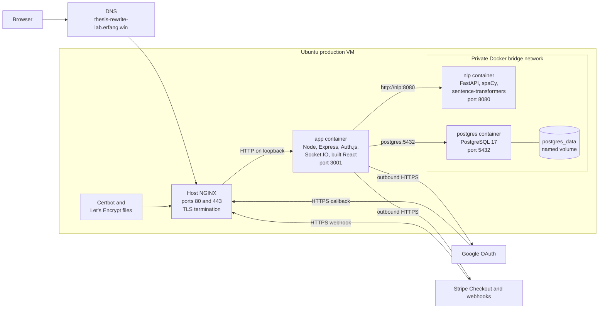
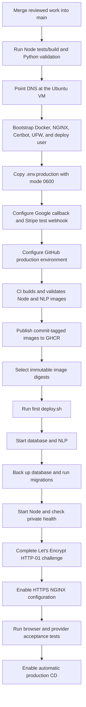
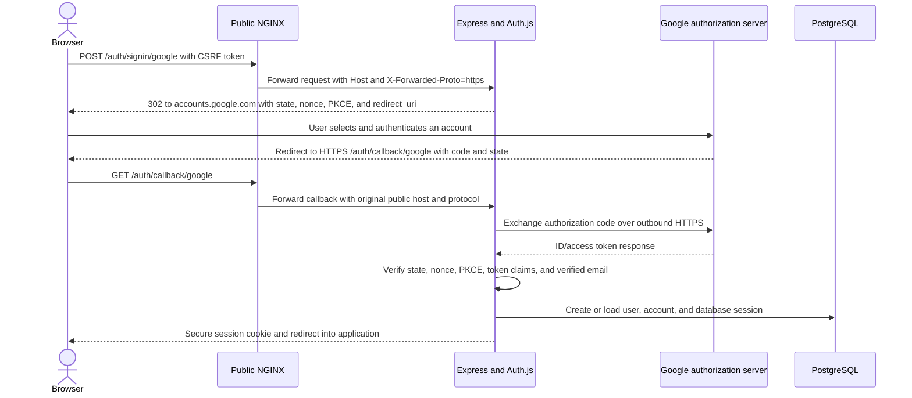
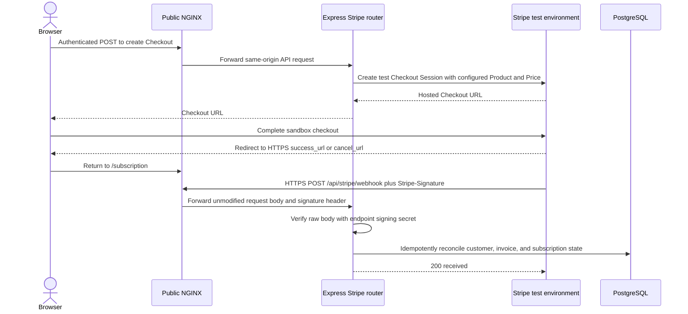
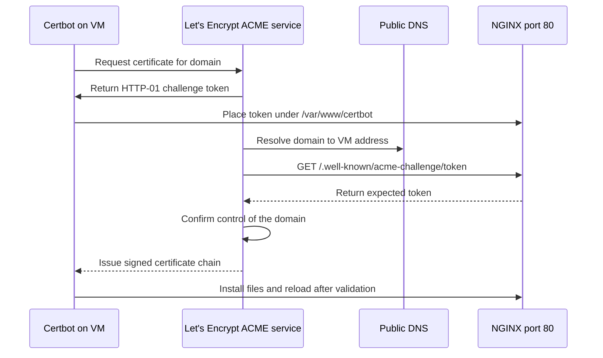
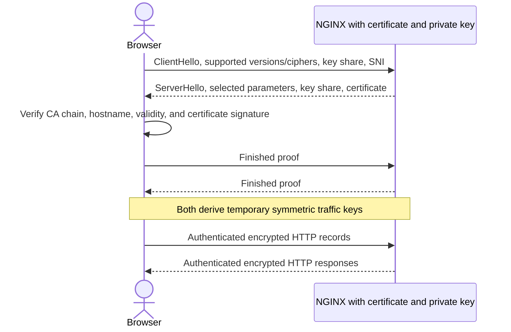
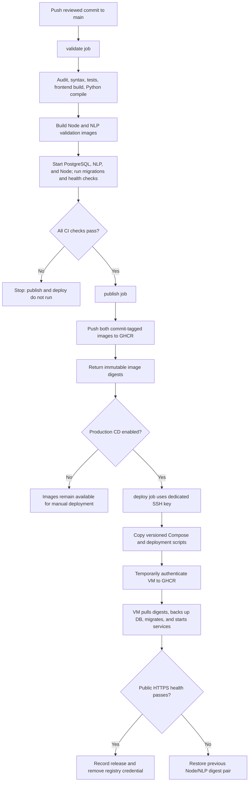

# Production Deployment

## 1. Purpose and deployed result

This document describes the production deployment of Thesis Rewriter from the
`main` branch. It covers the complete first-deployment procedure, the automatic
release procedure used after the first deployment, the Docker images, reverse
proxy, Google OAuth, Stripe, TLS certificate, CI/CD implementation, and
rollback design.

The public application is:

```text
https://thesis-rewrite-lab.erfang.win
```

The deployed release documented here is commit
`d26737025574fe91f88abcca0f3cfe2595c62f76`. GitHub Actions deployed the
following immutable image pair:

| Service | Production image |
| --- | --- |
| Node/React application | `ghcr.io/utsc-cscc09-programming-on-the-web/project-thesis-rewriter@sha256:7e3ba8250d9fefce4f42469c4621a3c4b69a787231959c00bdbf99838ea263a5` |
| Python NLP service | `ghcr.io/utsc-cscc09-programming-on-the-web/project-thesis-rewriter-nlp@sha256:797e2ee60688fc7cf051bd5836985e1121d93f3bc62b934cf705fa2280721c57` |
| PostgreSQL | `postgres:17-alpine@sha256:742f40ea20b9ff2ff31db5458d127452988a2164df9e17441e191f3b72252193` |

The first two digests are a release snapshot and will change when a later
commit is deployed.

Image digests are SHA-256 content identifiers. Unlike a reusable tag, a digest
identifies one exact image, so validation, deployment, and rollback can refer
to the same bytes.

## 2. Production architecture

Only host NGINX is exposed to the Internet. The Node application is published
on host loopback at `127.0.0.1:3001`. PostgreSQL and the FastAPI NLP service
have no host ports and are reachable only by service name on the private
Compose bridge network.



The internal NGINX-to-Node hop uses HTTP, but it never leaves the VM and Node
listens only on loopback. The Node-to-NLP and Node-to-PostgreSQL hops remain
inside Docker's private bridge. Internet clients cannot directly address
ports 3001, 8080, or 5432.

## 3. Complete deployment process

Deployment has two parts:

1. one-time infrastructure and provider setup; and
2. repeatable CI/CD releases from `main`.

### 3.1 Prerequisites

Before changing the VM:

1. Review and merge the authoritative integration branch into `main`.
2. Remove generated files such as Python bytecode and keep them ignored.
3. Confirm Node tests, the frontend build, Python source, and both production
   image builds pass.
4. Point the domain's DNS address record at the VM and wait for public
   resolution.
5. Verify that the VM is Ubuntu, has sufficient CPU, memory, and disk, and
   does not already use ports 80 or 443 for another application.
6. Prepare `local/deployment/.env.production`. This ignored local file is the
   source for VM runtime variables; it must never be committed or printed.
7. Configure Google OAuth, Stripe test mode, and the GitHub `production`
   environment.

Important production values include:

```text
APP_ORIGIN=https://thesis-rewrite-lab.erfang.win
DATABASE_URL=postgresql://...@postgres:5432/...
NLP_SERVICE_URL=http://nlp:8080
NODE_ENV=production
```

The environment file also contains the database password, Auth.js secret,
Google client credentials, Stripe test credentials and webhook secret, OpenAI
key and model names, and NLP feature settings. It is installed on the VM as
`deploy:deploy` with mode `0600`.

### 3.2 One-time VM bootstrap

The tracked [`deployment/scripts/bootstrap-server.sh`](../../deployment/scripts/bootstrap-server.sh)
script:

- verifies that it is running as root on Ubuntu;
- installs Docker Engine and Compose from Docker's Ubuntu repository;
- installs NGINX, Certbot, and UFW;
- creates the unprivileged `deploy` user;
- creates `/opt/thesis-rewriter`, backup, and state directories;
- installs the CI public key in the VM user's `authorized_keys`;
- initially installs the HTTP/ACME NGINX configuration;
- exposes only OpenSSH and NGINX through UFW; and
- enables Docker, NGINX, and the Certbot renewal timer.

The initial operator copies the tracked deployment directory and runs:

```bash
DEPLOY_PUBLIC_KEY_FILE=/root/deploy-ci.pub \
  bash deployment/scripts/bootstrap-server.sh
```

After signing out and back in to apply Docker group membership:

```bash
docker version
docker compose version
sudo nginx -t
sudo ufw status
```

### 3.3 Install and validate runtime variables

Copy the environment file without displaying it:

```bash
scp local/deployment/.env.production \
  deploy@project-thesis-rewriter.amazingcloud.space:/tmp/.env.production
```

On the VM:

```bash
sudo install -o deploy -g deploy -m 0600 \
  /tmp/.env.production /opt/thesis-rewriter/.env.production
rm -f /tmp/.env.production
/opt/thesis-rewriter/deployment/scripts/validate-env.sh \
  /opt/thesis-rewriter/.env.production
```

[`deployment/scripts/validate-env.sh`](../../deployment/scripts/validate-env.sh)
checks required names without echoing their values. It also rejects an HTTP
production origin, a database URL that does not use Compose service
`postgres`, an NLP URL that does not use service `nlp`, and duplicate
variables.

### 3.4 Configure external providers

Google Cloud uses a web application OAuth client:

```text
Authorized origin:
https://thesis-rewrite-lab.erfang.win

Authorized redirect URI:
https://thesis-rewrite-lab.erfang.win/auth/callback/google
```

Stripe is intentionally in test/sandbox mode for this assignment. The test
Product, monthly Price, secret key, and endpoint signing secret must all belong
to the same Stripe test environment. The registered webhook is:

```text
https://thesis-rewrite-lab.erfang.win/api/stripe/webhook
```

A webhook secret generated for a local Stripe CLI listener is not the secret
for the Dashboard-registered production-domain endpoint.

### 3.5 Configure the GitHub production environment

Create an environment named `production` and restrict it to `main`.

| Environment variable | Value |
| --- | --- |
| `DEPLOY_HOST` | `project-thesis-rewriter.amazingcloud.space` |
| `DEPLOY_PORT` | `22` |
| `DEPLOY_USER` | `deploy` |
| `PUBLIC_APP_ORIGIN` | `https://thesis-rewrite-lab.erfang.win` |

| Environment secret | Purpose |
| --- | --- |
| `DEPLOY_SSH_PRIVATE_KEY` | Dedicated private key used by the Actions runner to enter the VM |
| `DEPLOY_SSH_KNOWN_HOSTS` | Previously verified VM host key; prevents accepting an impersonated SSH server |

The repository variable `PRODUCTION_DEPLOY_ENABLED` is kept `false` until the
first manual release, HTTPS, integrations, restart behavior, and rollback have
been accepted. It is then changed to `true` to enable automatic CD.

### 3.6 First image deployment

GitHub Actions first validates and publishes both images. The first deployment
is run manually with the two digests produced by that successful workflow:

```bash
/opt/thesis-rewriter/deployment/scripts/deploy.sh \
  ghcr.io/utsc-cscc09-programming-on-the-web/project-thesis-rewriter@sha256:NODE_DIGEST \
  ghcr.io/utsc-cscc09-programming-on-the-web/project-thesis-rewriter-nlp@sha256:NLP_DIGEST
```

[`deployment/scripts/deploy.sh`](../../deployment/scripts/deploy.sh) performs
the following transaction-like sequence:

1. acquire a file lock so two releases cannot run concurrently;
2. validate `.env.production`;
3. record the new Node/NLP image pair and preserve the previous pair;
4. pull both images by immutable digest;
5. wait for PostgreSQL and NLP readiness;
6. create a timestamped compressed PostgreSQL backup;
7. run database migrations from the new Node image;
8. start and wait for the Node application;
9. check Node and NLP health endpoints; and
10. record the release as current only after all checks pass.

If a step fails, the error trap attempts to restore the previous application
image pair. The PostgreSQL volume is not removed.

### 3.7 Issue and renew the TLS certificate

After DNS resolves to the VM and port 80 is reachable, rehearse against Let's
Encrypt staging:

```bash
sudo LETSENCRYPT_EMAIL=operator@example.com \
  LETSENCRYPT_STAGING=true \
  bash deployment/scripts/issue-certificate.sh
```

Then issue the trusted certificate:

```bash
sudo LETSENCRYPT_EMAIL=operator@example.com \
  bash deployment/scripts/issue-certificate.sh
```

The script verifies that the domain resolves to the current VM, uses Certbot's
webroot HTTP-01 challenge, installs the final HTTPS NGINX configuration,
installs a post-renewal NGINX reload hook, and runs a renewal dry run.

### 3.8 Acceptance and automatic deployment

Acceptance includes:

- public `GET /api/health`;
- HTTP-to-HTTPS redirection;
- certificate hostname and chain validation;
- complete Google login and logout;
- Stripe test Checkout and signed webhook delivery;
- document upload, save, and reload;
- OpenAI and NLP workflows;
- Socket.IO through NGINX;
- recovery after a VM/container restart; and
- restoration of the previous image pair.

After acceptance, set:

```text
PRODUCTION_DEPLOY_ENABLED=true
```

Every later push to `main` follows the automatic pipeline in section 8.

### 3.9 End-to-end first-deployment flowchart



## 4. Docker files, images, functions, and principles

### 4.1 Node/React application image

The root [`Dockerfile`](../../Dockerfile) is a multi-stage Dockerfile based on
a digest-pinned `node:22-bookworm-slim` image.

| Stage | Function |
| --- | --- |
| `dependencies` | Copies the npm manifests and runs deterministic `npm ci` |
| `build` | Copies source and produces the Vite `dist/` frontend |
| `production-dependencies` | Installs only runtime packages with `npm ci --omit=dev` |
| `runtime` | Copies the built frontend, production dependencies, server source, and migration scripts |

The final image:

- runs as the unprivileged `node` user;
- exposes port 3001;
- starts `npm start`, which runs `node app.js`;
- serves both the Express API and built React application;
- runs Auth.js, Stripe, Socket.IO, migrations, and Node-to-NLP integration; and
- contains a health check for `/api/health`.

Multi-stage construction keeps the complete build workspace and development
dependencies out of the runtime stage. The image contains executable code and
runtime dependencies, but it does not contain `.env.production` or local
secrets.

### 4.2 Python NLP image

[`server/nlp_service/Dockerfile`](../../server/nlp_service/Dockerfile) uses a
digest-pinned `python:3.12.11-slim` base. It installs:

- FastAPI and Uvicorn;
- spaCy and `en_core_web_sm`;
- NumPy;
- CPU-only PyTorch;
- Transformers and sentence-transformers; and
- the pinned `sentence-transformers/all-MiniLM-L6-v2` model revision.

The embedding model is downloaded during the image build. Runtime enables
Hugging Face and Transformers offline modes, so a container restart does not
depend on downloading a model from the Internet. It runs as the unprivileged
`nlp` user, uses one Uvicorn worker on port 8080, and reports readiness through
`/health`.

This is why Python packages must not be installed separately on the VM. The
image already contains the Python interpreter, native wheels, language model,
application source, and exact runtime dependencies.

### 4.3 PostgreSQL image

There is no custom PostgreSQL Dockerfile. Production Compose uses the
digest-pinned official PostgreSQL 17 Alpine image. Its role is persistent
application, Auth.js, document, job, and subscription storage.

Database files live in the named `postgres_data` volume. A container can be
replaced without replacing the volume. This separates an immutable application
release from mutable production data.

### 4.4 Compose and build-context files

[`compose.production.yaml`](../../compose.production.yaml) joins the three
services and defines:

- health-based startup ordering;
- a private `backend` bridge network;
- a loopback-only app port;
- the persistent PostgreSQL volume;
- restart policies and graceful stop periods;
- read-only Node/NLP root filesystems with temporary `/tmp`;
- dropped Linux capabilities and `no-new-privileges`; and
- CPU and memory limits for NLP.

The root [`.dockerignore`](../../.dockerignore) excludes Git metadata, local
secrets, keys, tests, bytecode, local artifacts, and existing build output from
the Node build context. The NLP
[`.dockerignore`](../../server/nlp_service/.dockerignore) excludes Python
bytecode, virtual environments, and tool caches.

The underlying principle is **build once, deploy the same artifact**. CI
creates immutable, layered images. Production starts those images with
environment-specific variables and persistent storage. No source compilation
or package installation occurs on the VM.

## 5. Reverse proxy, Google OAuth, and Stripe

### 5.1 Reverse proxy principle

A reverse proxy accepts requests on behalf of an internal application. The
client knows only the public NGINX origin; it does not know that Node listens
on port 3001. NGINX:

1. accepts TCP/TLS connections on public port 443;
2. selects the virtual host by domain;
3. decrypts and validates the HTTPS connection;
4. forwards the HTTP method, path, headers, and body to
   `http://127.0.0.1:3001`; and
5. returns the upstream response over the encrypted client connection.

[`deployment/nginx/thesis-rewriter.conf`](../../deployment/nginx/thesis-rewriter.conf)
sets:

```nginx
proxy_set_header Host $host;
proxy_set_header X-Real-IP $remote_addr;
proxy_set_header X-Forwarded-For $proxy_add_x_forwarded_for;
proxy_set_header X-Forwarded-Proto $scheme;
```

`Host` and `X-Forwarded-Proto` are especially important. Express trusts exactly
one proxy hop, so it can reconstruct the public HTTPS origin even though its
direct NGINX connection is HTTP. Auth.js and Stripe return URLs must see
`https://thesis-rewrite-lab.erfang.win`, not `http://127.0.0.1:3001`.

NGINX also forwards the HTTP Upgrade and Connection headers used by WebSocket/
Socket.IO connections. Increased proxy header buffers accommodate the large
Google OAuth redirect response, while `proxy_buffering off` avoids delaying
long or streaming application responses.

### 5.2 Google OAuth connection

Google sign-in is an OAuth 2.0/OpenID Connect authorization-code flow managed
by Auth.js:



The Google console redirect URI must exactly match:

```text
https://thesis-rewrite-lab.erfang.win/auth/callback/google
```

The public proxy headers, `APP_ORIGIN`, and Google configuration therefore all
describe the same HTTPS origin. Auth.js also enables `state`, `nonce`, and
PKCE checks, requests only `openid email profile`, and accepts only a
Google-verified email.

Helmet's Content Security Policy permits forms to navigate only to the
application itself and Google's authorization origin:

```text
form-action 'self' https://accounts.google.com
```

This narrow exception is necessary because the same-origin Auth.js form POST
redirects the browser to Google. It does not permit arbitrary form
destinations.

### 5.3 Stripe connection

Stripe has two independent paths:

1. an interactive browser redirect to Stripe-hosted Checkout; and
2. a server-to-server webhook from Stripe to the application.



Webhook delivery is asynchronous. The application does not assume that the
browser's success redirect and Stripe's webhook arrive in a particular order;
the redirect is user navigation, while trusted billing state is reconciled
from signed Stripe data.

The application validates that the configured Stripe Price is active,
test-mode, recurring monthly, USD, belongs to the configured Product, and
meets the minimum amount. Checkout `success_url`, `cancel_url`, and Customer
Portal return URLs are derived from the HTTPS `APP_ORIGIN`.

Webhook authenticity does not depend only on NGINX or the source IP. Express
mounts `/api/stripe/webhook` with `express.raw()` before the global JSON
parser. The handler verifies the exact raw bytes, `Stripe-Signature` header,
and endpoint-specific `STRIPE_WEBHOOK_SECRET` with Stripe's
`constructEvent()` function. Processed event IDs are recorded so a retried
event does not apply the same state transition twice.

## 6. Let's Encrypt certificate and TLS encryption

### 6.1 What the certificate is

Let's Encrypt is a public Certificate Authority. Its X.509 certificate binds
the domain name `thesis-rewrite-lab.erfang.win` to the public key corresponding
to the private key held on the VM.

The certificate is public and is sent to every connecting browser. The
private key in:

```text
/etc/letsencrypt/live/thesis-rewrite-lab.erfang.win/privkey.pem
```

is the secret. NGINX also serves `fullchain.pem`, which includes the site
certificate and intermediate certificate needed to build a chain to a root
already trusted by the browser.

### 6.2 Domain validation and renewal

Certbot uses the ACME HTTP-01 protocol:



Port 80 remains available for the ACME challenge. Other HTTP requests receive
a permanent redirect to the corresponding HTTPS URL. `certbot.timer` performs
renewal checks, and the deploy hook validates and reloads NGINX after a renewed
certificate is installed.

### 6.3 TLS principle

The production NGINX configuration enables TLS 1.2 and TLS 1.3. In simplified
form:



Public-key cryptography authenticates the server and protects the key
agreement. The handshake derives shared, per-connection symmetric keys.
Symmetric authenticated encryption then provides:

- **confidentiality**: observers cannot read application data;
- **integrity**: undetected modification is rejected; and
- **authentication**: the browser verifies that it reached the holder of the
  private key for the certified domain.

TLS does not mean the certificate itself encrypts every request. The
certificate authenticates the server's public key; the handshake establishes
efficient symmetric traffic keys that encrypt the HTTP records.

## 7. CI implementation

Continuous Integration is implemented by
[`.github/workflows/ci-cd.yml`](../../.github/workflows/ci-cd.yml). Pull
requests and pushes to `main` run the `validate` job:

1. check out the exact Git commit on an ephemeral GitHub-hosted runner;
2. install locked Node dependencies with `npm ci`;
3. reject high/critical production npm advisories;
4. validate Node syntax;
5. run tracked tests;
6. build the React frontend;
7. compile-check Python source;
8. build the Node and NLP images;
9. audit installed Python packages;
10. start isolated PostgreSQL and NLP validation containers;
11. run database migrations from the Node image; and
12. start the Node image and require its health endpoint to pass.

Failure stops publication. Therefore, an image cannot be released unless the
same image design has passed dependency, build, migration, and runtime checks.

## 8. CD implementation

For a non-pull-request run on `main`, successful CI unlocks `publish`. That job
uses Buildx to build and push both images to GHCR under the exact Git commit
SHA. Its outputs are the registry-generated Node and NLP digests.

When `PRODUCTION_DEPLOY_ENABLED=true`, `deploy` then:

1. enters the protected GitHub `production` environment;
2. installs the dedicated VM SSH key and verified host key on the temporary
   runner;
3. packages and copies `compose.production.yaml` and `deployment/` to the VM;
4. gives the VM temporary GHCR access using the job's `GITHUB_TOKEN`;
5. invokes `deploy.sh` with the two immutable digests;
6. checks the public HTTPS health endpoint;
7. automatically invokes `rollback.sh` if public health does not recover; and
8. runs `docker logout ghcr.io` on the VM even when a prior step fails.

Only one production job runs at a time because the workflow uses a
`production` concurrency group without cancellation.



### 8.1 Why the VM does not pull branches

CD does not require a person to log into the VM and run `git pull`, and the VM
does not contain a working copy of the repository.

The Git operations happen on the disposable Actions runner. The runner checks
out the exact triggering commit, builds complete runtime images, and publishes
them to an image registry. The VM receives only:

- the tracked Compose file and deployment scripts; and
- immutable Node/NLP image references.

Docker then pulls those binary artifacts by digest. Application source,
compiled frontend assets, Node dependencies, Python dependencies, and the NLP
model are already inside the images.

This design avoids several problems associated with deploying by branch:

- a branch name can move, but a digest cannot;
- the VM cannot accidentally build a different dependency graph;
- no compilers, npm, pip, Git checkout, or repository history are required on
  the production host;
- rollback selects a previous image pair instead of trying to reconstruct an
  old working tree; and
- the exact tested artifacts, rather than merely the same source commit, reach
  production.

The workflow still uses non-interactive SSH to run the deployment script. The
point is that neither a human login nor repository access from the VM is
required.

### 8.2 Why this deployment does not use a GitHub Deploy Key

A GitHub Deploy Key is an SSH public key attached to one GitHub repository. A
machine holding the private half uses it to clone or pull that repository.
That solves a direction of access this architecture does not need: **VM to
GitHub source repository**.

This deployment instead needs **GitHub Actions runner to VM** access. The
dedicated key therefore has:

- its private half in the GitHub `production` environment secret
  `DEPLOY_SSH_PRIVATE_KEY`; and
- its public half in `/home/deploy/.ssh/authorized_keys` on the VM.

This is an ordinary restricted server SSH key, not a GitHub repository Deploy
Key. Registering it as a Deploy Key would not help the Actions runner enter the
VM and would unnecessarily give the VM access to repository source.

GHCR access is also separate. The publish job receives `packages: write`; the
deploy job receives `packages: read`. GitHub creates a short-lived
`GITHUB_TOKEN` for the workflow job. The token is streamed through SSH to
`docker login`, used to pull private images, and removed with `docker logout`
afterward. No long-lived repository or registry credential remains on the VM.

## 9. Rollback and data safety

Run:

```bash
/opt/thesis-rewriter/deployment/scripts/rollback.sh
```

The script serializes the operation with the deployment lock, restores the
previous recorded Node/NLP pair, waits for both containers, checks Node health,
and swaps the current/previous release records.

Application rollback does **not** reverse database migrations and does not
restore database contents. Each deployment creates a compressed database
backup in:

```text
/opt/thesis-rewriter/backups/postgres-YYYYMMDDTHHMMSSZ.sql.gz
```

Restoring one of those files is a separate destructive disaster-recovery
operation and requires an explicit maintenance decision.

## 10. Security and operational summary

- Only ports 22, 80, and 443 are intentionally public.
- HTTPS ends at NGINX; the application port is loopback-only.
- PostgreSQL and NLP are private Docker services.
- Base images and production releases are pinned by digest.
- Node and NLP run as non-root users with read-only filesystems and dropped
  capabilities.
- Secrets remain in a mode-`0600` VM environment file or protected GitHub
  environment secrets, not in images or Git.
- Google OAuth uses one exact HTTPS callback and Auth.js state, nonce, PKCE,
  and verified-email checks.
- Stripe uses test-mode resources and verifies the raw signed webhook body.
- Deployment is health-gated, serialized, backed up, and automatically
  rollback-capable.
- The VM runs prebuilt artifacts; it does not build application source.

## 11. Primary references

- [Docker: multi-stage builds](https://docs.docker.com/build/building/multi-stage/)
- [Docker: image digests](https://docs.docker.com/dhi/explore/security-concepts/digests/)
- [NGINX HTTP proxy module](https://nginx.org/en/docs/http/ngx_http_proxy_module.html)
- [NGINX WebSocket proxying](https://nginx.org/en/docs/http/websocket.html)
- [Google OAuth 2.0 for web server applications](https://developers.google.com/identity/protocols/oauth2/web-server)
- [Google OpenID Connect](https://developers.google.com/identity/openid-connect/openid-connect)
- [Stripe webhooks](https://docs.stripe.com/webhooks)
- [Stripe webhook signature verification](https://docs.stripe.com/webhooks/signature)
- [Let's Encrypt challenge types](https://letsencrypt.org/docs/challenge-types/)
- [TLS 1.3, RFC 8446](https://www.rfc-editor.org/info/rfc8446/)
- [GitHub Actions `GITHUB_TOKEN`](https://docs.github.com/en/actions/concepts/security/github_token)
- [GitHub Actions deployments and environments](https://docs.github.com/en/actions/reference/workflows-and-actions/deployments-and-environments)
- [GitHub Deploy Keys](https://docs.github.com/en/authentication/connecting-to-github-with-ssh/managing-deploy-keys)
