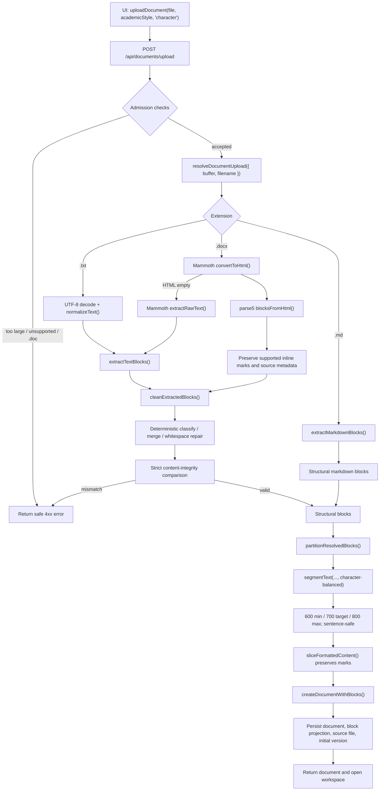
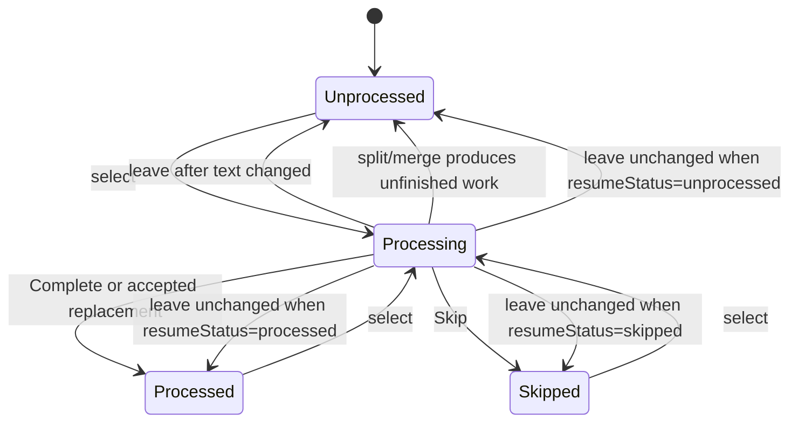
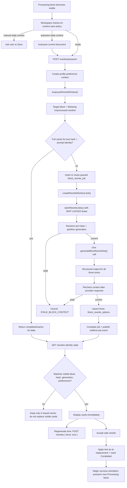
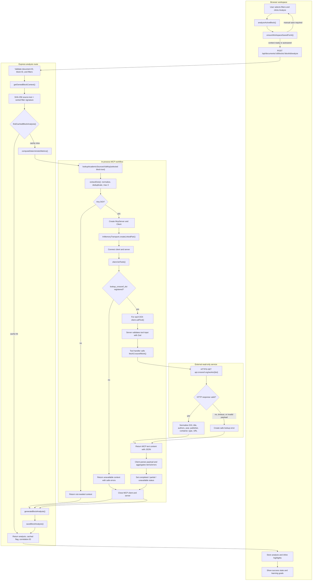

# Existing UI/UX Upgrades: Final Workflow and Maintenance Report

## 1. Purpose and current-version scope

This report is the maintenance handoff for the current Existing UI/UX Upgrades release. It documents the behavior implemented in the homepage, profile subpages, document workspace, upload parser, block model, editor history, AI workflows, background rewrite worker, writing preferences, owl animation, and supporting UI.

The source code is the final authority. The principal modules are:

| Area | Primary modules |
| --- | --- |
| Homepage shell and navigation | `src/pages/HomePage.jsx`, `src/components/HomeShell.jsx`, `src/components/HomeHeader.jsx`, `src/components/HomeSidebar.jsx` |
| Homepage subpages | `src/pages/homepageAccount.jsx`, `src/pages/HomepageWritingPreferences.jsx`, `src/pages/homepageVersionControl.jsx`, `src/pages/homepageTrash.jsx`, `src/pages/homepageCredits.jsx`, `src/pages/homepageSupport.jsx`, `src/pages/HomepageSubscription.jsx` |
| Workspace controller | `src/pages/WorkspacePage.jsx` |
| Editor and toolbar | `src/components/DocumentEditor.jsx`, `src/components/EditorToolbar.jsx`, `src/components/AcademicStylePanel.jsx` |
| Import resolver and cleanup | `src/services/documentResolver.js`, `src/lib/documentCleanup/*`, `src/lib/blockSegmentation/*` |
| Block rules | `src/lib/blockState.js`, `src/lib/editorBlockCommands.js`, `src/lib/editorFormattingCommands.js`, `server/models/blocks.js` |
| Save and version history | `src/lib/workspaceSavePolicy.js`, `src/lib/documentMutationCoordinator.js`, `server/models/documents.js`, `server/models/versions.js` |
| AI workflows | `server/ai/blockRewrites.js`, `server/ai/blockAnalysis.js`, `server/ai/practiceFeedback.js`, `server/ai/rewriteWorker.js` |
| AI persistence | `server/models/rewriteJobs.js`, `server/models/rewrites.js`, `server/models/analyses.js`, `server/models/practice.js` |
| Writing preferences | `src/shared/writingPreferences.js`, `server/models/users.js` |
| Owl animation | `src/components/OwlContainer.jsx`, `src/pages/libraries/animations/createOwlAnimator.jsx` |

The final architecture intentionally separates:

- document content and formatting state;
- block workflow state;
- transient editor selection;
- persisted AI cache identity;
- background AI job state;
- visual animation state.

This separation prevents a React render in one area from rebuilding or resetting unrelated state.

---

## 2. Homepage and subpage UI/UX

### 2.1 Shared homepage shell

`HomePage` owns the page selection and document list. `HomeShell` provides one consistent header, main-content container, and right navigation sidebar for every homepage view.

The shared layout has these properties:

- `home-main` uses the same padding and available-width calculation for Docs and all subpages.
- `home-main-inner` is centered and capped at `1180px`, so subpages no longer appear narrower than the Docs homepage.
- The document grid responds through container queries: three columns, then two, then one.
- The mobile sidebar closes when the user clicks outside it.
- There is no generic `home-back-to-docs` control. Navigation remains in the sidebar, while the version-detail view retains its local “Back to documents” action because it returns to the version document picker rather than changing the global page.
- Header actions can be hidden for focused subpages such as Trash, Support, and Credits while retaining the mobile sidebar toggle.
- Search and sorting are calculated locally from the realtime document collection. Supported ordering is most/least recent and most/least completed.

### 2.2 Docs homepage

The Docs view contains:

- a completion banner computed from the profile completion rate;
- responsive mountain artwork and progress UI;
- create-document and upload actions;
- a one-to-three-column document card grid;
- search and sort controls;
- larger document menu hit targets and light-green menu hover/active states;
- an empty state when no active documents exist.

Creating or uploading a document updates realtime state and opens the returned document in the workspace.

### 2.3 Account/profile overlay

The account panel is a local overlay opened by the profile badge. It supports:

- profile image upload;
- account information;
- navigation to Writing preferences;
- logout.

The profile image response is versioned in its URL with the profile update timestamp so the browser does not reuse an old image.

### 2.4 Writing preferences

The Writing preferences view is nested inside the account panel and uses the same dropdown and button visual language as the workspace.

It contains:

- **Autosave for docs**, a profile-level toggle;
- audience knowledge;
- domain context;
- vocabulary density;
- sentence structure;
- document structure;
- claim posture;
- feedback detail;
- custom instructions, limited to 500 characters;
- a compact summary of active preferences;
- Reset and Save actions.

Important behavior:

- Preferences are not applied until **Save preferences** is clicked.
- Saving persists `autosave_docs` and structured `writing_preferences` in the user profile.
- Successful save closes the Writing preferences view and returns to the profile view.
- There is no separate “Apply saved preferences” toggle. Saved preferences are global defaults.
- “No preference” removes that field from the saved object. If all fields are empty, no supplemental preference prompt is emitted.
- Reset changes the form locally; it must still be saved.
- The heading uses bold Arial styling, matching the final design.

### 2.5 Version history

Version history first displays the user’s documents. Selecting one loads:

- the current document;
- its saved versions;
- a block-aware comparison;
- Revert controls.

The difference view uses the same typography on both sides. Removed text is shown only in the old version and added text only in the current version. A revert:

1. restores the stored document and block snapshot;
2. recalculates progress;
3. increments the document revision;
4. appends a new version labelled with the reverted version number.

Revert does not delete history.

### 2.6 Trash

Trash is backed by realtime trash-document state and supports:

- Restore;
- Delete Forever with confirmation;
- total item and character counts.

The empty UI uses the larger trash illustration and “No items in trash.” If loading fails, the same centered area displays “Could not load trash” and the safe error message.

### 2.7 Credits

Credits presents the current reused assets and links each credited asset to its source. External links open safely in a separate browsing context.

### 2.8 Support

Support currently presents a deliberate unavailable-state message. It is a routed subpage, not a broken or unbound button.

### 2.9 Subscription

The subscription page is a separate route with Basic/Pro presentation, checkout, payment-recovery, cancellation, and resumption states. Confirmation dialogs distinguish:

- leaving without a required subscription;
- leaving while retaining the subscription;
- leaving while scheduling cancellation.

---

## 3. Uploaded-document architecture

### 3.1 Public trigger

The simplest upload trigger is:

```js
uploadDocument(file, academicStyle, "character")
```

This calls `POST /api/documents/upload`. The server-side module boundary is:

```js
resolveDocumentUpload({ buffer, filename })
partitionResolvedBlocks(structuralBlocks, "character")
```

The first method resolves source structure and safe inline formatting. The second applies the shared character-balanced block policy.

### 3.2 Supported files and admission checks

The document workflow accepts:

- `.txt`;
- `.md`;
- `.docx`.

Legacy `.doc` is explicitly rejected. The client and Multer middleware both enforce a `2.5 MB` limit. The original uploaded bytes, filename, and MIME type are stored with the document; parsing does not deliberately truncate the middle of the file.

### 3.3 Upload flowchart



### 3.4 Source adapters

#### Plain text

`normalizeText()`:

- removes a UTF-8 BOM;
- removes null characters;
- normalizes CRLF/CR to LF.

Plain text initially splits on one or more blank paragraphs. Each section becomes a paragraph-shaped structural block and then enters deterministic cleanup.

#### Markdown

The markdown adapter recognizes:

- headings `#` through `######`;
- blockquotes;
- unordered list items;
- ordered items using `1.` or `1)`;
- fenced code blocks, including an `unclosed` marker when the final fence is missing;
- ordinary paragraphs.

#### DOCX

DOCX uses Mammoth to produce HTML, then `parse5` to walk paragraph, heading, list item, blockquote, and table-cell elements. Supported inline marks are retained:

- bold;
- italic;
- underline;
- code.

`<br>` is represented as a Tiptap `hardBreak`. Empty paragraphs become temporary structural boundaries. If HTML conversion yields no content, raw-text extraction is the fallback.

### 3.5 Deterministic cleanup

The cleanup implementation follows the rule-based workflow in `local/papers/deterministic-dirty-text-cleanup-workflow.md`; document-generation instructions from that plan are not part of the import runtime.

`cleanExtractedBlocks()` performs the following:

1. Normalize repeated horizontal whitespace.
2. Normalize line breaks without blindly replacing all breaks.
3. Preserve a break around annotations or between a completed sentence and a clear new uppercase sentence.
4. Repair spaced uppercase abbreviations such as `M R I` to `MRI`.
5. Repair missing spaces in formal `FIGURE n.n` captions.
6. Classify blocks in priority order.
7. Merge punctuation, connectors, cross-references, and likely continuation fragments.
8. Attach markers such as `(a)` or `(b)` to their associated content where appropriate.
9. Retain hard structural boundaries, headings, figure captions, and image descriptions.
10. Remap whitespace while preserving inline marks.
11. Compare normalized source and output character streams.

The main classifiers are:

| Type | Representative signal | Result |
| --- | --- | --- |
| Heading | source heading metadata or short high-confidence title case | Heading structure and explicit heading style overrides |
| Figure caption | `FIGURE 2.35...` | Protected caption boundary |
| Annotation | `(a)`, `(1)`, `1)`, `1.`, Roman numerals, multilevel numbers | Retained marker; attached where context permits |
| Cross-reference | `Figure 2.35a`, `Chapter 2` | Merged as a sentence fragment when appropriate |
| Connector | punctuation-only or small connector fragment | Joined punctuation-aware |
| Image description | contextual “figure”, “illustration”, “MRI”, “photograph”, or “diagram” opener | Protected description boundary |
| Ordinary paragraph | no stronger classification | Continuation-aware merging |

Merging uses punctuation-aware spacing: punctuation is not prefixed with a space, while ordinary words are. A formal structural boundary, heading, caption, image description, or completed distinct paragraph stops merging.

### 3.6 Integrity rule

Cleanup is structural, not semantic. In strict mode:

```js
normalizeForIntegrityCheck(sourceText)
  === normalizeForIntegrityCheck(cleanedText)
```

The normalization removes whitespace and applies NFC normalization. A mismatch stops the import rather than silently losing, adding, or reordering substantive characters.

### 3.7 Block segmentation policy

The shared public method is:

```js
segmentText(source, {
  strategy: "character-balanced",
  minChars: 600,
  targetChars: 700,
  maxChars: 800,
  locale: "en",
})
```

Rules:

- sentence boundaries come from `Intl.Segmenter`;
- common abbreviations do not terminate a sentence;
- consecutive blank lines are hard boundaries;
- a sentence is never truncated to satisfy a character target;
- a sentence longer than 800 characters remains one oversized block;
- otherwise, blocks target 700 characters and remain within 600–800 where the sentence boundaries permit;
- a short final block is merged backward only if the merged block remains within 800;
- block slices remain lossless, including inter-sentence whitespace;
- formatted content is sliced by the same source offsets so bold/italic/underline/code marks survive.

Each structural source paragraph receives a `paragraphIndex`. Multiple AI blocks may therefore live inside one visual paragraph without being converted into unrelated paragraphs.

### 3.8 Persisted import result

`createDocumentWithBlocks()`:

- creates UUID block IDs;
- sets the first nonempty block to `processing`;
- sets remaining blocks to `unprocessed`;
- records the first block’s `resumeStatus = "unprocessed"` and baseline text;
- builds Tiptap `content_json`;
- persists the normalized block projection;
- stores the original source;
- calculates document and user progress;
- creates an “Initial import” version.

---

## 4. Block data model and maintenance principles

### 4.1 Two synchronized representations

The document has two synchronized forms:

1. `documents.content_json`: the complete Tiptap document used by the editor.
2. `document_blocks`: an ordered relational projection used for progress, AI context, caches, and background jobs.

Within Tiptap, a block is an inline `blockSegment` node inside a structural paragraph or heading. This permits multiple tracked blocks in one natural paragraph.

### 4.2 Core persisted block structure

```json
{
  "id": "b73f...uuid",
  "document_id": "a12e...uuid",
  "block_index": 4,
  "text_content": "The selected source text...",
  "status": "processing",
  "resume_status": "unprocessed",
  "processing_baseline_text": "The selected source text...",
  "change_source": "none",
  "partition_generation": 2,
  "format_overrides": ["fontSize", "textAlign"],
  "char_length": 605,
  "attrs": {
    "blockId": "b73f...uuid",
    "status": "processing",
    "resumeStatus": "unprocessed",
    "processingBaselineText": "The selected source text...",
    "changeSource": "none",
    "partitionGeneration": 2,
    "formatOverrides": ["fontSize", "textAlign"],
    "paragraphIndex": 3,
    "lineHeight": "2.0",
    "textIndent": "0.5in",
    "textAlign": "left",
    "fontFamily": "Times New Roman",
    "fontSize": "12pt",
    "sourceType": "paragraph",
    "level": null,
    "length": 605
  },
  "tiptap_node": {
    "type": "blockSegment",
    "attrs": "...same normalized attributes...",
    "content": [
      { "type": "text", "text": "The selected source text..." }
    ]
  }
}
```

### 4.3 Field meanings

| Field | Maintenance meaning |
| --- | --- |
| `id` / `blockId` | Stable block identity used by UI, server context, cache keys, and jobs |
| `block_index` | Global reading order |
| `paragraphIndex` | Natural structural paragraph membership |
| `status` | `unprocessed`, `processing`, `processed`, or `skipped` |
| `resumeStatus` | Status to restore if a Processing block is left unchanged |
| `processingBaselineText` | Text captured when the block entered Processing |
| `changeSource` | `none`, `manual`, `ai-replacement`, or `practice-replacement` |
| `partitionGeneration` | Increments when the block topology changes; rejects stale worker output |
| `formatOverrides` | Local properties intentionally retained against a global style |
| `length` / `char_length` | Unicode code-point count used for segmentation and progress |
| `sourceType` / `level` | Imported paragraph/heading/caption/description semantics |

### 4.4 Block status state machine

The database enforces at most one Processing block per document.



Terminology note: the UI says **Completed**; the persisted enum is `processed`.

### 4.5 Processing baseline rule

Selecting a block records:

```text
resumeStatus = previous status
processingBaselineText = current text
status = processing
changeSource = none
```

When the user selects another block:

- if current text equals `processingBaselineText`, restore `resumeStatus`;
- if text differs, use `unprocessed` and `changeSource = manual`;
- clear `resumeStatus` and `processingBaselineText`.

This direct comparison replaces a cumulative “ever changed” flag. If edits are fully undone back to the baseline, the original status is restored.

### 4.6 Complete and Skip

Complete and Skip:

1. set the target terminal status;
2. clear its processing baseline;
3. select the next `unprocessed` block below it;
4. wrap to the first `unprocessed` block if necessary;
5. leave no Processing block if all work is terminal;
6. recalculate progress.

Skip additionally:

- removes rewrite, analysis, and practice caches for that block;
- cancels queued/running rewrite jobs with `BLOCK_SKIPPED`;
- increments the client block epoch so late responses cannot reappear;
- displays a transparent content area with a gray frame.

Reopening an originally Skipped block sets `resumeStatus = skipped`. It is not automatically prewarmed, and cards use **Regenerate for skipped**.

### 4.7 Partition recalculation rule

Only text addition or deletion can schedule automatic repartitioning.

The editor compares a map of block text before and after every transaction. Repartitioning is scheduled only when all of the following are true:

- the document changed;
- the tracked text sequence changed;
- at least one block text changed;
- the transaction is not normalization;
- it is not already a partition transaction;
- it is not a structural selection-isolation transaction;
- it does not carry `skipEditorBlockPartition`;
- it is not a protected programmatic update.

Formatting, status changes, AI/practice replacements, analysis decorations, pagination, and list renumbering never schedule automatic repartitioning.

### 4.8 Incremental split

After a manual text edit, if the affected block exceeds 800 characters:

1. run the shared character-balanced strategy;
2. retain the original ID for the first segment;
3. generate UUIDs for later segments;
4. retain Processing only on the segment containing the cursor;
5. set the others to Unprocessed;
6. increment `partitionGeneration`;
7. retain inline content and local style attributes.

The transaction records the surviving IDs and generation.

### 4.9 Incremental merge

If an edited block is shorter than 600 characters, it can merge into the preceding block only when:

- both share the same structural container;
- both share `paragraphIndex`;
- no consecutive-newline boundary separates them;
- the combined text is at most 800 characters.

The preceding ID survives, the later ID retires, the generation increments, and the result is unfinished. Processing is retained when either the selected block or preceding block is Processing.

### 4.10 Explicit line and structural transforms

- A single Enter creates a `hardBreak` inside the tracked segment.
- A second consecutive Enter creates a new structural paragraph/block boundary and new block identity.
- Bullet list, ordered list, and blockquote may apply to a whole block, a selected fragment, or a selection across blocks.
- A partial structural selection is isolated in the same transaction as the list/quote transform. Undo therefore restores both the prior text structure and the transform.
- Ordered lists maintain Tiptap numbering. Right-clicking an ordered list opens **Renumber from 1**, which sets list `start = 1` and `restartNumbering = true` without repartitioning.

### 4.11 Block visual geometry

All four statuses use one SVG polygon-frame system calculated from the actual client rectangles of the block’s wrapped lines:

| Status | Fill | Border |
| --- | --- | --- |
| Processing | light amber | dark amber |
| Unprocessed | light red | dark red |
| Completed/processed | light green | dark green |
| Skipped | transparent | gray |

The polygon tightly follows wrapped lines with right-angled joins. Frame padding is outside the text, so text highlight does not overflow it. `separateAdjacentBlockRects()` distributes a minimum visual gap between adjacent horizontal or vertical frame edges, preventing doubled borders and overlaps.

The Skip/Complete action palette is separate from the status-frame geometry and follows the selected block.

---

## 5. Workspace state, tool effects, saving, undo, and restore

### 5.1 State layers

The workspace maintains several intentionally separate layers:

| Layer | Owner | Purpose |
| --- | --- | --- |
| Persisted document | PostgreSQL + `selectedDocument` | Saved title, style, content, revision, block projection |
| Editor draft | Tiptap + `workspaceDraft` + `editorContent` | Current unsaved content and attributes |
| Workflow selection | `activeEditorBlock`, `currentProcessingBlockId` | Active block and Processing state |
| Save state | `workspaceDirty`, `workspaceAiContextDirty`, `workspaceSaving` | Leave policy and AI context readiness |
| AI presentation | rewrite cards/cache, analyses/highlights, practice state | Responses currently safe for the visible identity |
| UI state | sidebar, mobile panels, modes, modals | Presentation only |
| Animation state | owl animator instance | Independent passive/thinking/magic/error lifecycle |
| Realtime state | `RealtimeProvider` | Profile, documents, revisions, versions, jobs |

`normalizeWorkspaceDraft()` and `normalizeContentJsonBlocks()` are the principal reconciliation boundaries. Both reassert valid IDs, statuses, baselines, generations, lengths, and the one-Processing invariant.

### 5.2 Dirty-state meanings

`workspaceDirty` means some document state must be persisted before a clean leave.

`workspaceAiContextDirty` is narrower: the server’s text or academic-style context is stale for an AI request.

Examples:

| Change | `workspaceDirty` | `workspaceAiContextDirty` |
| --- | ---: | ---: |
| Title | yes | no |
| Block status | yes | no |
| Bold, color, font, alignment | yes | no |
| Text added/deleted | yes | yes |
| Academic template/custom style | yes | yes |
| AI/practice text replacement | yes | yes |
| AI cache result arriving | no | no |
| Rewrite card open/closed | no | no |

AI responses and prewarm caches do not themselves make the document dirty.

### 5.3 Autosave and manual save

Profile preference `autosaveDocs` selects the policy:

#### Autosave on

- A dirty workspace schedules a save after 1,200 ms of inactivity.
- Editing again invalidates the pending generation and starts a new delay.
- Leaving with dirty work performs an autosave and then leaves.
- An AI request with stale server context performs an autosave first.
- Autosaves do not append a document-version snapshot.

#### Autosave off

- Save remains manual.
- Leaving a clean document does not show a prompt.
- Leaving a dirty document shows Save / Leave without saving behavior.
- AI can use current persisted context when only status or formatting changed.
- AI is blocked with a clear save instruction when text or academic-style context changed.
- A manual save appends a version.

`createDocumentMutationCoordinator()` serializes document writes and applies a response to the active editor only if it is the newest queued mutation and no later local edit generation exists. This prevents an older save response from overwriting newer work.

### 5.4 Save-time format audit

Before a manual save, `auditDocumentFormatting()` compares each block with the selected global style.

If differences exist, the user can:

- normalize blocks to the global style; or
- keep local formatting.

Normalizing writes global line height, indentation, alignment, font, and size and clears overrides. Keeping local formatting:

- stores the differing property names in each block’s `formatOverrides`;
- changes the document’s academic style label to `Customized`;
- prevents later global normalization from silently erasing acknowledged local differences.

### 5.5 Toolbar layout and effects

The toolbar uses four strict responsive grids:

1. Save, Bold, Italic, Underline, Undo, Redo, Block quote.
2. Left, Center, Right, Justify, Outdent, Indent, Bullet list, Ordered list.
3. Paragraph/heading, Font, Size, Line spacing.
4. Five text-color controls and four highlight controls.

Widths and gaps use `clamp()` and fractional grid tracks. Page Break is removed from the visible toolbar.

Tool behavior:

| Tool | Tiptap effect | Text mutation? | Repartition? | History |
| --- | --- | ---: | ---: | --- |
| Save | persist normalized draft; optionally version it | no | no | not an editor transaction |
| Bold | toggle `bold` mark | no | no | yes |
| Italic | toggle `italic` mark | no | no | yes |
| Underline | toggle `underline` mark | no | no | yes |
| Undo / Redo | ProseMirror history transaction | depends on restored transaction | only if restored text differs | history operation |
| Block quote | isolate selection, toggle blockquote | no | no | one grouped transaction |
| Align left/center/right/justify | set structural `textAlign` | no | no | yes; values are mutually exclusive |
| Outdent / Indent | set paragraph `textIndent` to `0in` / `0.5in` | no | no | yes |
| Bullet list | isolate selection, toggle bullet list | no | no | one grouped transaction |
| Ordered list | isolate selection, toggle ordered list | no | no | one grouped transaction |
| Renumber from 1 | set ordered-list start and restart flag | no | explicitly skipped | yes |
| None | paragraph with `outlineLevel = none` | no | no | yes |
| Paragraph | paragraph with paragraph outline marker | no | no | yes |
| Heading 1–3 | heading node with level and visible heading size | no | no | yes |
| Font | `fontFamily` text-style mark | no | no | yes |
| Size | `fontSize` text-style mark | no | no | yes |
| Line spacing | structural `lineHeight` | no | no | yes |
| Text swatches | set black, green, yellow, or red text | no | no | yes |
| Multicolor picker | set arbitrary RGB text color | no | no | yes |
| Highlight swatches | toggle yellow, green, or red highlight | no | no | yes |
| Clear highlight | unset highlight | no | no | yes |

There is no separate clear-text-color button.

If the user has a real text selection, formatting applies to it, including selections across blocks. If selection is empty, `runToolbarCommand()` temporarily expands to the current Processing block, applies the command, and restores the original caret. This preserves both direct-selection and default-Processing-block workflows.

### 5.6 Undo and redo calculation

The final undo/redo behavior is transaction-based, not a separate per-block queue:

1. Toolbar formatting is executed through one Tiptap chain.
2. The temporary Processing-block selection and the mark/attribute mutation are in that same transaction.
3. The caret is restored before dispatch.
4. A single Undo therefore reverses one color, highlight, font, alignment, or other toolbar action.
5. Redo replays that same transaction.
6. Structural selection isolation and its list/quote transform are grouped together.
7. Color changes are mark changes in the same global editor history, preventing cross-block color reconstruction from independent snapshots.

Status-only selection changes are deliberately marked `addToHistory = false`; they are workflow state, not a text-formatting undo item. They are restored through the Processing baseline rule, a manual unsaved leave, or persisted version history.

The history is global to the active Tiptap editor document. Clicking another block does not replace the editor or create a new per-block history stack.

### 5.7 Restore calculations

There are four kinds of restore:

#### Processing baseline restore

```text
currentText === processingBaselineText
  ? restore resumeStatus
  : set unprocessed/manual
```

#### Editor undo/redo

ProseMirror restores the complete transaction, including marks, attributes, structural splits, and text.

#### Leave without saving

The local draft is discarded and the next load uses the last persisted document.

#### Version revert

`revertDocumentToVersion()` restores the full stored document and block snapshot, recalculates progress, increments revision, and appends a new version recording the revert.

### 5.8 Scroll-position protection

Global automatic scroll-to-block behavior is disabled. The editor protects both the paper scroller and browser window:

- transactions capture the current paper and window coordinates;
- formatting, status changes, normalization, and protected programmatic transactions request exact preservation;
- restoration occurs immediately and over animation frames to survive layout completion;
- large accidental resets are detected by `shouldRestoreEditorScroll()`;
- status updates explicitly restore the captured coordinates;
- editor reload of the same document carries `pendingEditorScrollRestoreRef`.

The browser’s “Forced reflow” performance warning is not itself the cause of navigation. The frame renderer must measure line rectangles, but the scroll guard prevents those layout measurements or adjacent AI panel rerenders from resetting the document viewport.

### 5.9 Page layout and Customized style

The paper uses A4 dimensions, a 54px visual gutter between pages, and per-page margin simulation.

Customized controls include:

- Normal, Narrow, Moderate, or Custom margin preset;
- independent top/right/bottom/left margins;
- each side from `0.0in` through `2.5in` at `0.1in` intervals;
- indentation;
- page-number position.

Font family and spacing were removed from Customized because those are editor toolbar controls.

Page numbers are plain dark-green bold numbers, not “Page X” labels. Supported positions are:

- top right;
- bottom center;
- bottom right.

---

## 6. AI workflow, caching, workers, preferences, and prompts

### 6.1 Three workspace modes

The final order is:

1. Rewriting;
2. Analyzing;
3. Practicing.

Each mode uses the active block identity, not the visual card position, as its data key.

### 6.2 AI context readiness

Before any direct AI request:

```js
aiSavePolicy({
  aiContextDirty: workspaceAiContextDirty,
  autosaveDocs,
})
```

returns:

- `ready`;
- `autosave-first`;
- `manual-save-required`.

This ensures the server worker reads the same text and academic style the user sees without making ordinary cache arrivals trigger save prompts.

### 6.3 End-to-end rewrite flowchart

The simplest automatic trigger is:

```js
prewarmDocumentBlockRewrites(documentId, blockId)
```

The direct single-tone trigger is:

```js
generateDocumentBlockRewrites(documentId, blockId, {
  tone,
  force
})
```



### 6.4 Rewrite prewarm window

Without supplemental preferences, the prewarm window is six blocks:

- current block;
- up to five following Unprocessed blocks.

With supplemental preferences, it is three blocks to control prompt and provider workload.

The worker makes one structured provider request per block and returns all three tones, instead of repeating the shared prompt three times.

Originally Skipped blocks are excluded from automatic enqueueing.

### 6.5 Rewrite cache identity

A rewrite option is uniquely identified by:

```text
documentId
+ blockId
+ SHA-256(source text)
+ tone
+ model
+ promptVersion
```

A background job additionally binds:

```text
partitionGeneration
```

The client also includes the writing-preference key in its in-memory cache lookup.

The worker checks text hash and generation:

- before provider work;
- again before persistence.

The UI checks:

- document ID;
- block ID;
- source hash/canonical status;
- partition generation;
- local visible context key;
- block epoch;
- preference identity.

Late results are still retained under their correct identity but cannot overwrite cards for another block or an older block state.

### 6.6 Cache behavior by edit/status

| Event | Rewrite cache behavior |
| --- | --- |
| Select unchanged block | exact identity displays immediately |
| Move to next block | automatic prewarm/get cycle runs for that block |
| Manual text edit | old source-hash cache is hidden but retained; button says **Regenerate for edited** |
| Undo back to old exact text | old source hash matches and cache can display again |
| AI/practice replacement | new text hash; old entries remain historical but do not match |
| Font, color, size, alignment, indentation | source hash unchanged; cache can still match |
| Skip | all AI caches for that block are deleted and active jobs cancelled |
| Reopen originally Skipped block | no automatic job; **Regenerate for skipped** |
| Preference change | new prompt version/fingerprint creates a separate cache identity |
| No preferences | uses legacy `block-rewrites-v1`, preserving pre-preference cache compatibility |

The rewrite button is never labelled “Generate.” Valid states are:

- **Processing...**;
- **Regenerate**;
- **Regenerate for skipped**;
- **Regenerate for edited**;
- **Retry rewrite**.

Queued/running and automatic-miss states are disabled. Skipped-regeneration buttons use a fixed shared width and height across cards.

### 6.7 Rewrite worker

`createRewriteWorker()`:

- polls every 750 ms by default;
- uses configurable concurrency, default `2`;
- claims jobs with `FOR UPDATE SKIP LOCKED`;
- leases jobs for two minutes;
- performs all three tones in one call;
- persists structured options in parallel;
- publishes job changes through realtime;
- retries transient rate-limit/timeout/server failures up to three attempts;
- uses exponential delay capped at 60 seconds;
- stores only a safe public error code in job state.

### 6.8 Writing-preference composition

Preferences are structured data, not a second free-form persona.

`createRewritePreferenceContext()`:

1. normalizes saved preferences;
2. applies optional request overrides;
3. permits explicit clearing with `null` or an empty value;
4. sanitizes custom instructions;
5. rejects custom text that tries to override prompts, rules, modes, or message hierarchy;
6. creates a stable ordered value;
7. fingerprints it with SHA-256;
8. derives the cache/prompt version.

No selected preferences:

```text
effectivePreferences = {}
fingerprint = "none"
promptVersion = "block-rewrites-v1"
supplement = ""
```

Selected preferences:

```text
promptVersion =
  "block-rewrites-v1:writing-preferences-v1:<16-character fingerprint>"
```

`compileWritingPreferenceSetSupplement()` emits one shared supplement for the three-tone request and appends only the tone-specific precedence exceptions that are required. It does not duplicate the entire preferences prompt per tone.

Preference priority is:

```text
safety and source fidelity
  > selected rewrite tone
    > structured writing preferences
      > sanitized custom instruction
```

Tone-specific conflict rules ensure, for example:

- Accessible & Concise remains concise when “elaborated” sentences are selected.
- Formal & Academic remains formal when plain vocabulary is selected.
- Persuasive & Argumentative remains evidence-safe when cautious claims are selected.

The effective preference snapshot, compiled supplement, warnings, schema version, and compiler version are stored with rewrite results so historical output remains explainable.

### 6.9 Rewrite prompt wording

Current rewrite prompts explicitly require:

- exactly one selected block;
- source text treated as untrusted quoted content;
- neighboring blocks used only for continuity;
- preservation of meaning, claim strength, logic, citations, quotations, names, numbers, statistics, equations, and technical terms;
- no invented facts, evidence, examples, citations, or certainty;
- concrete teaching explanations;
- structured `meaningPreserved` and warning fields.

The three tone definitions are:

- **Formal & Academic**: objectivity, precision, neutrality, and research-first language.
- **Persuasive & Argumentative**: active verbs, clear reasoning, and significance.
- **Accessible & Concise**: direct sentences, plain language, active voice, and no filler.

### 6.10 Analysis workflow and cache

Analysis supports four filters:

- clarity;
- conciseness;
- academic style;
- logical flow.

Cache identity:

```text
documentId
+ blockId
+ SHA-256(source text)
+ sorted filter signature
+ model
+ analysis prompt version
```

Before provider work the server calculates deterministic text metrics. It may also run the local academic-sources MCP workflow:

- extract at most three DOI values;
- call the read-only `lookup_crossref_doi` tool;
- retrieve bibliographic metadata from Crossref;
- report completed, partial, unavailable, or not-needed status;
- never treat metadata as proof that a claim is true.

The MCP server is created with an in-memory transport for this workflow; it is not a general document parser or rewrite engine.

The structured analysis returns one result for every selected filter, a summary, issue evidence, and learning goals. Results are written to state immediately after success, and inline issue decorations are keyed by the current block and source text.

### 6.11 Academic-sources MCP workflow (unchanged)

The Existing UI/UX Upgrades work did **not** modify the academic-sources MCP workflow. It remains an analysis-only, read-only enrichment step implemented by `server/mcp/academicSources.js`. Rewriting, Practice, document parsing, block partitioning, saving, and Writing preferences do not call this MCP server.

The workflow is deliberately fail-open:

- a cached analysis returns without calling MCP or Crossref;
- a block without a DOI returns `status = "not-needed"`;
- a partial or failed Crossref lookup is represented as reference metadata and safe errors;
- MCP unavailability does not prevent the AI analysis from continuing;
- external metadata is treated as untrusted reference data;
- Crossref metadata may identify bibliographic precision problems but is never evidence that an academic claim is true.

#### 6.11.1 MCP components and boundaries

| Component | Current responsibility |
| --- | --- |
| `lookupAcademicSourcesViaMcp(text)` | Extract DOI candidates, create the local MCP session, invoke the tool, aggregate results, and close resources |
| `extractDois(text)` | Extract, normalize, deduplicate, and limit DOI candidates to three |
| `createAcademicSourcesMcpServer()` | Register the one read-only MCP tool |
| MCP server name | `thesis-rewriter-academic-sources` |
| MCP tool name | `lookup_crossref_doi` |
| MCP transport | Linked in-memory client/server transport |
| `fetchCrossrefWork(doi)` | Make the external HTTPS request to Crossref |
| External endpoint | `GET https://api.crossref.org/works/{encoded-doi}` |
| Timeout | Five seconds by default; configured values are constrained to 1–15 seconds |
| Tool result | MCP text content containing normalized JSON or a safe error payload |
| Analysis consumer | `generateBlockAnalysis()` through `externalSourceContext` |

The registered MCP tool declares:

- `readOnlyHint: true`;
- `destructiveHint: false`;
- `idempotentHint: true`;
- `openWorldHint: true`.

Its input is validated as one DOI string between 6 and 255 characters. It does not receive authentication data, document IDs, the full document, editor state, profile preferences, or mutation permissions.

#### 6.11.2 Complete communication and external tool-call chain

The following flow includes the communication immediately before the MCP call, the complete MCP and Crossref chain, and the continuation after the call:



#### 6.11.3 Exact before-call behavior

Before MCP is invoked:

1. `analyzeActiveBlock()` confirms an active block and at least one selected filter.
2. The workspace resolves AI save policy. Unsaved text or academic-style context is autosaved or requires a manual save.
3. The route validates UUIDs and filter names.
4. `getOwnedBlockContext()` confirms ownership and loads the selected block plus its immediate previous and next blocks.
5. The server calculates the source-text hash, normalized filter signature, and model/prompt identity.
6. `findCachedBlockAnalysis()` checks the exact analysis cache.
7. Only a cache miss calculates deterministic metrics and calls `lookupAcademicSourcesViaMcp()` with the selected block text.

This placement means MCP is not repeated for an exact analysis cache hit.

#### 6.11.4 External tool call

For a block containing DOI values:

1. DOI punctuation is trimmed, values are lowercased and deduplicated, and at most three are retained.
2. A new local `McpServer` and `Client` are created.
3. `InMemoryTransport.createLinkedPair()` connects them without opening a public MCP network port.
4. The client lists tools and verifies that `lookup_crossref_doi` is available.
5. The client calls that tool once per DOI.
6. The tool handler calls `fetchCrossrefWork()`.
7. `fetchCrossrefWork()` performs an HTTPS GET to Crossref with:
   - `Accept: application/json`;
   - the Thesis Rewriter user agent;
   - optional `mailto` contact information;
   - an abort timeout.
8. A successful Crossref work is reduced to the fields needed by analysis: DOI, title, authors, publication year, publisher, container title, work type, and canonical DOI URL.
9. Tool success and failure are both returned through MCP text-content payloads. Raw provider errors and stack details are not passed to the browser.
10. The client aggregates all calls as `completed`, `partial`, or `unavailable`, then closes both MCP endpoints in `finally`.

DOIs are processed sequentially inside the MCP session. This bounds external traffic and preserves predictable result ordering.

#### 6.11.5 After-call behavior

After MCP returns:

1. `generateBlockAnalysis()` receives the lookup object as `externalSourceContext`.
2. The AI prompt explicitly labels that object as untrusted reference data.
3. The provider receives the selected block, neighboring blocks, selected filters, filter definitions, academic style, and the bounded external context.
4. The AI must return one structured result for every requested filter.
5. The result and source-lookup status are saved in `block_analyses` under the exact source/filter/model/prompt cache identity.
6. The route returns the formatted analysis and correlation ID.
7. The browser writes the response to the current analysis key, installs evidence-based inline decorations, shows learning goals, and ends the thinking animation.
8. Client block epochs and request keys prevent a response for an earlier selection from replacing the currently visible analysis.

This unchanged MCP boundary keeps external source lookup observable and replaceable without coupling it to the editor, block state machine, rewrite worker, or preference compiler.

### 6.12 Practice workflow and cache

Practice requires a successful analysis for the exact current block text.

Cache identity:

```text
documentId
+ blockId
+ SHA-256(source text)
+ SHA-256(student attempt)
+ analysis record ID
+ model
+ practice prompt version
```

The response contains:

- original and revision scores for meaning preservation, clarity, academic style, and grammar;
- strengths;
- prioritized hints;
- short insertable phrases;
- next step;
- `readyToApply`.

Practice retains the analysis goals while the request runs. A block epoch and request-context key prevent an earlier response from clearing or replacing the goals/feedback for a newer selection or attempt.

The server checks suggestions against the analysis evidence. If a suggested phrase reproduces wording the analysis flagged, one corrected retry is requested. Failure to produce consistent guidance returns a safe error rather than contradictory coaching.

**Apply Your Rewritten Version** replaces the active block with `changeSource = practice-replacement`, marks it Completed, and advances the workflow. The replacement is a protected programmatic text mutation and does not trigger automatic repartitioning.

### 6.13 AI cards and panel UX

- Rewriting, Analysis, and Practice cards share scroll-safe containers.
- The final card has enough bottom padding to scroll fully above the container edge.
- Nested analysis note cards inherit the parent category accent color.
- Analysis rows use consistent width.
- Disabled AI actions show the prohibited cursor.
- AI panels reject stale responses instead of visibly refreshing the wrong block.
- Blackboard artwork is not selectable or draggable.

---

## 7. Owl animation architecture

The owl SVG is isolated from document renders.

`OwlContainer.jsx` generates its injected markup once:

```js
const OWL_INNER_HTML = Object.freeze({
  __html: createOwlMarkup(),
});
```

and later uses:

```jsx
dangerouslySetInnerHTML={OWL_INNER_HTML}
```

The stable object identity is essential: typing in the editor no longer replaces the owl’s SVG DOM and hard-resets active animation state.

Animation modes are independently maintained by `createOwlAnimator()`:

- standby/passive;
- thinking;
- answer/success;
- error;
- wand materialization/tremor;
- magic projectile.

Thinking starts whenever:

- a direct rewrite is running;
- rewrite prewarm cards are queued or running;
- analysis is running;
- practice feedback is running.

`thinking.svg` is made visible immediately when the request begins. Because switching modes clears all indicators, `startThinking()` deliberately restores it after `stopPassiveAnimations()`. It is removed on success, cancellation, failure, or disposal.

After a magic action, `resumePassiveAfterMagic()` restarts head, body, eyes, and feet while preserving the visible wand pose and tremor. This prevents the head/body/foot freeze that previously remained after applying an AI result.

---

## 8. Other workspace UI/UX changes

### 8.1 Header and panels

- Desktop sidebar toggle has safe inset spacing and cannot overflow the left panel.
- Desktop Back is on the right side of the paper header.
- The title input is centered with a dark-green border.
- Mobile header places the options/sidebar toggle, title, and Back action in one row.
- Mobile header and toolbar heights are reduced to align with desktop density.
- Workspace history is labelled as other documents rather than an ambiguous duplicate History view.

### 8.2 Toolbar polish

- Strict four-row layout removes irregular row lengths.
- Bold and Italic vector glyphs are proportionally larger.
- Dropdown options use light-green hover, focus, active, and selected states.
- The custom text-color input is a multicolor circle matching the swatches.
- Alignment states are competitive rather than coexisting.

### 8.3 Paper and blocks

- Every page uses top, right, bottom, and left margins.
- Page gaps resemble a modern word processor.
- Page numbers have only the number, in bold dark green.
- Block fill has no internal blank stripes between wrapped lines.
- Adjacent block borders receive a minimum gap.
- Skipped blocks have no fill.
- AI/status operations preserve scroll position.

### 8.4 AI panel polish

- Rewrite, analysis, and practice order is consistent in desktop and mobile views.
- Rewriting button wording reflects cache/job state.
- Skipped regeneration controls have uniform dimensions.
- Practice character count and feedback action use the final layout.
- Apply buttons share the rewrite interaction and wand behavior.
- Bottom padding prevents the final card from being clipped.

---

## 9. Persistence and realtime summary

The final persistence model is:

```text
users
  -> profile preferences and autosave policy

documents
  -> title, academic style, global style settings, content_json,
     original source, revision, progress, active block

document_blocks
  -> ordered block projection and status machine

document_versions
  -> immutable save/revert snapshots

block_rewrite_options
  -> rewrite cache by exact source and prompt identity

block_rewrite_jobs
  -> leased background work by source hash and partition generation

block_analyses
  -> analysis cache by source/filter identity

block_practice_attempts
  -> practice cache by source/attempt/analysis identity
```

Realtime publishes document, version, progress, profile, subscription, and AI job changes. The workspace rejects remote revisions while a local mutation is pending or the local draft is dirty, avoiding silent replacement of unsaved work.

---

## 10. Maintenance invariants

Future changes must preserve these invariants:

1. At most one nonempty Processing block exists per document.
2. A Processing block always carries a valid resumable status and baseline.
3. Leaving Processing compares current text directly with the baseline.
4. Only manual text addition/deletion schedules automatic split/merge.
5. Formatting and status changes never partition blocks.
6. AI/practice replacements never automatically partition blocks.
7. Split/merge increments `partitionGeneration`.
8. Background AI output is accepted only for the same block, hash, generation, model, prompt version, and preference context.
9. Skip clears all AI state for that block.
10. AI cache arrival never marks the document dirty.
11. Manual save creates a version; autosave does not.
12. No dirty leave prompt appears for a clean document.
13. Formatting commands use the real selection or the whole Processing block.
14. One toolbar action produces one undoable transaction.
15. Status-only transitions are excluded from editor history.
16. Scroll position is preserved for formatting, status, AI-panel, and protected programmatic updates.
17. Owl markup identity remains stable across React renders.
18. Empty writing preferences emit no supplemental prompt and keep the legacy rewrite prompt/cache version.
19. Imported cleanup must preserve normalized character order.
20. Multiple AI blocks may remain inside one natural paragraph.

---

## 11. Verification and delivery checklist

The repository provides these main checks:

```bash
npm run check:server
npm run test:ai
npm run test:unit
npm run build
```

Integration tests additionally require the configured PostgreSQL test databases:

```bash
npm run test:integration
```

The automated coverage includes:

- document resolver and cleanup;
- upload partitioning;
- block segmentation and state transitions;
- block frame geometry;
- editor block commands;
- scroll guard;
- save policy;
- format audit;
- mutation coordinator;
- AI result identity;
- rewrite prompts and preferences;
- analysis and practice contracts;
- MCP academic-source lookup;
- server block normalization;
- version diff;
- owl thinking-request lifecycle.

Manual acceptance should verify:

- Docs and every subpage share the same content width.
- Mobile and desktop headers do not overflow.
- Uploading the dirty DOCX fixture preserves headings, markers, inline emphasis, and natural paragraphs.
- Figure-caption fragments and `(a)/(b)` markers are not isolated incorrectly.
- Formatting an empty selection affects the Processing block.
- Formatting does not partition or scroll the document.
- Text insertion/deletion triggers only the affected split/merge.
- Undo/redo works once per color or formatting action across block changes.
- Right-click ordered-list renumbering starts at 1.
- Skip is gray/transparent and clears AI state.
- Reopening Skipped shows uniform **Regenerate for skipped** controls.
- Cached results display automatically after block advancement.
- Fast block switching cannot display or refresh a stale result.
- Analysis appears immediately after success.
- Practice retains goals and displays feedback immediately.
- Thinking, success, error, wand, and passive owl animations enter and exit correctly.
- Autosave on/off follows the profile preference and clean documents never prompt on leave.
- Manual save creates a version and version revert restores the complete block snapshot.

This checklist is the release definition of done for the Existing UI/UX Upgrades workflow.
