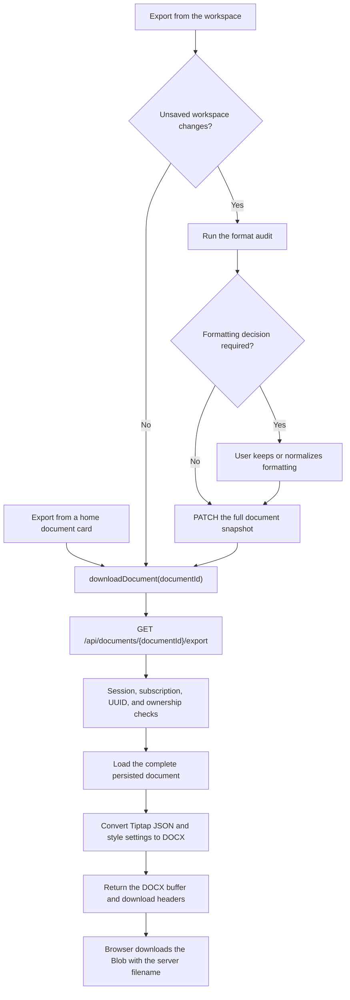

# DOCX Export

The export feature turns the latest persisted document content into `.docx` file. It is available from both the document menu on the home page and the editor toolbar in the workspace.

The current implementation supports DOCX only.

## End-to-end workflow



There are two client entry paths:

- A home-page export immediately requests the persisted document from the server.
- A workspace export first saves the document when the editor has unsaved changes. This guarantees that the downloaded file contains the current title, content, block data, and style settings. A clean workspace skips the save and exports immediately.

## File workflow

| Stage | File | Responsibility | Related API |
| --- | --- | --- | --- |
| Home export control | `src/components/DocumentMenu.jsx` | Displays the Export action and disables/relabels it while the request is running. | — |
| Home component wiring | `src/components/DocumentCard.jsx` and `src/components/DocumentsSection.jsx` | Pass the selected document, export callback, and exporting document ID through the card hierarchy. | — |
| Home export state | `src/pages/HomePage.jsx` | Calls the download helper, tracks the exporting card, and displays `home-api-notice` only when the export fails. | `GET /api/documents/{id}/export` |
| Workspace export control | `src/components/EditorToolbar.jsx` and `src/components/DocumentEditor.jsx` | Displays the toolbar Export button and passes the export state and callback to it. | — |
| Save-before-export orchestration | `src/pages/WorkspacePage.jsx` | Audits formatting, optionally opens the format-review dialog, saves dirty workspace data, and then starts the export. | `PATCH /api/documents/{id}`, then `GET /api/documents/{id}/export` |
| Browser download client | `src/services/documentsApi.js` | Sends the export request, reads the binary response and filename, creates a temporary object URL, and triggers the browser download. | `GET /api/documents/{id}/export` |
| API mounting and access control | `app.js` and `server/routers/index.js` | Mount the API router and apply session, product-user, and paid-subscription middleware before document routes. | All `/api/documents/*` routes |
| Export route | `server/routers/documents.js` | Validates the ID, verifies ownership and active status, calls the generator, and returns the file headers and buffer. | `GET /api/documents/{id}/export` |
| Document lookup | `server/models/documents.js` | Loads the owner-scoped document, including content, style settings, and blocks. | Used by the export route |
| DOCX generator | `server/export/documentExport.js` | Converts document data into Word objects, sanitizes the filename, and packs the result into a DOCX buffer. | Used by the export route |
| API specification | `src/openapi.yml` | Documents the binary export endpoint, response headers, and error responses. | `GET /api/documents/{id}/export` |
| Export tests | `server/export/documentExport.test.js` | Tests filename safety and verifies that generated DOCX files preserve representative headings, bold text, and lists. | Generator-level test |

## API workflow

### 1. Save a dirty workspace

The save step uses the existing document update endpoint:

```http
PATCH /api/documents/{documentId}
Content-Type: application/json
```

The workspace sends a complete normalized snapshot containing:

- `title`
- `academicStyle`
- `styleSettings`
- `contentJson`
- `createVersion`
- `versionLabel`

The save uses the same formatting audit as a normal manual save. If the audit detects local formatting that differs from the selected academic style, the user must choose whether to keep it or normalize it. The saved document returned by the API is then passed to the export step.

This request is skipped when the workspace has no unsaved changes.

### 2. Download the DOCX file

```http
GET /api/documents/{documentId}/export
Accept: application/vnd.openxmlformats-officedocument.wordprocessingml.document
```

| Contract item | Value |
| --- | --- |
| Authentication | Same-origin session cookie |
| Subscription | Paid/pro entitlement required |
| Request body | None |
| Success status | `200 OK` |
| Response body | Binary DOCX data |
| Content type | `application/vnd.openxmlformats-officedocument.wordprocessingml.document` |
| Cache policy | `private, no-store` |
| Filename source | Sanitized document title from `Content-Disposition` |

The server sends both an ASCII fallback filename and a UTF-8 filename. The browser client prefers the UTF-8 `filename*` value, falls back to the quoted filename, and then uses a generic DOCX name if neither value is usable.

The browser does not navigate away from the application. It reads the response as a `Blob`, creates a temporary object URL, clicks a hidden download link, and then removes the link and revokes the object URL.

### Error responses

| Status | Meaning | Client behavior |
| --- | --- | --- |
| `400` | The document ID is not a valid UUID. | Shows an export error. |
| `401` | The session is missing or expired. | Dispatches the shared authentication-expired event and rejects the export. |
| `403` | The account does not have the required subscription. | Dispatches the shared subscription-required event and rejects the export. |
| `404` | The document does not exist, belongs to another user, or is in the trash. | Shows an export error without exposing document ownership. |
| `500` | DOCX generation or another server operation failed. | Shows an export error. |

On the home page, `home-api-notice` is reserved for errors, so a successful export downloads silently. The workspace uses its own notice area and may show either an export success or error message.

## DOCX conversion

The source editor data is Tiptap JSON. `server/export/documentExport.js` maps that data to the `docx` library as follows:

| Source data | DOCX result |
| --- | --- |
| Document root | One Word section |
| Paragraph | Word paragraph with alignment, spacing, and indentation |
| Heading levels 1–6 | Corresponding Word heading level |
| Text | Word text run |
| Bold, italic, strike, and underline marks | Matching text-run formatting |
| Code mark | Monospace text run |
| Font family, font size, text color, and highlight | Matching Word run properties |
| Hard break | Word line break |
| Bullet list | Bulleted Word list with nesting levels |
| Ordered list | Numbered Word list with nesting levels |
| Blockquote | Indented Word paragraph |
| `style_settings` | Page margins, body font, size, line spacing, first-line indent, and page-number placement |

Exports use A4 page dimensions. The default document style is Times New Roman, 12 pt, double-spaced text, one-inch margins, and a centered page number in the footer. Stored document style settings override those defaults.

Unknown container nodes are traversed recursively so that supported text inside them is not silently discarded.

## Filename handling

The export filename is derived from the document title:

- Characters that are invalid in Windows filenames and control characters are removed or replaced.
- An existing `.docx` suffix is not duplicated.
- Very long titles are shortened.
- A missing or unusable title falls back to `Untitled document.docx`.
- Unicode titles use the UTF-8 `filename*` response parameter while retaining an ASCII fallback.


## Extension points

To add another export format, keep the UI orchestration and access-control flow, then add:

1. A format-specific generator beside `server/export/documentExport.js`.
2. A route contract that selects or identifies the requested format.
3. The matching MIME type, filename extension, and client response handling.
4. OpenAPI documentation and format-specific tests.

An export does not modify the database or emit a realtime event. Only the optional save-before-export step changes persisted document state.
