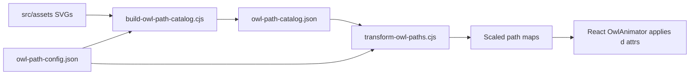

# Owl Animation System

Last updated: 2026-07-05

This document describes the **as-built** owl animation sandbox (`local/animations/`), its four major composite modes, path tooling under `scripts/`, and the path toward a reusable React component in `src/`.

The original planning draft lived in `local/animations/REPORT.md`; this file replaces it with verified behavior from the current implementation.

---

## 1. Sandbox overview

| Item | Location |
| :--- | :--- |
| Interactive test page | `local/animations/test.html` (open directly in a browser) |
| JS modules | `local/animations/js/*.js` — global namespace `window.OwlAnim` |
| CSS modules | `local/animations/css/*.css` |
| Source art (read-only) | `src/assets/owl.svg`, `magic_wand.svg`, indicators, wing reference SVGs |
| Path catalog (generated) | `scripts/generated/owl-path-catalog.json` |

The sandbox embeds the full owl SVG inline in `test.html` (including the magic wand group inside `#left_wing_group`) so animations can target internal path IDs under `file://` without fetch restrictions.

### Module map

| File | Responsibility |
| :--- | :--- |
| `state.js` | Global state, timers, element cache, stage mode cleanup |
| `svg-loader.js` | Indicator preload, original path storage |
| `eyes.js` | Blink, observe, think, surprise, chase |
| `head.js` | Head rotate/shake/stabilized, think rotation |
| `right-wing.js` | Right wing lift, tremor, back (path morph + group rotate) |
| `left-wing.js` | Left wing + wand path morph tables |
| `wand.js` | Show, tremor, use magic, retract |
| `particles.js` | Note smoke, magic projectile trail |
| `standby.js` | Standby variant scheduler |
| `test-page.js` | Toolbar wiring, composite orchestration |

---

## 2. Library readiness assessment

The animation code is **modular and event-bindable**, but still **sandbox-shaped** (global `OwlAnim`, inline SVG in test HTML). Below is readiness by major composite.

### C01 — Standby (`standby`)

| Aspect | Status |
| :--- | :--- |
| Reusable API | **Partial** — `O.enterStandby(choice, hooks)` exists; `test-page.js` wraps it as `startStandby(choice)` |
| Event binding | **Ready** — call `startStandby("random" \| "head-shake" \| "observe-mark" \| "sleep-notes" \| "head-rotate")` on any trigger |
| Interrupt rules | **Ready** — thinking, error, magic, and toolbar reset call `stopPassiveAnimations()` first |
| React gap | Needs a component wrapper that mounts SVG once and exposes `setMode("standby", options)` |

Variants loop internally (`random` cycles every 6.5s). `observe-mark` runs foot marking for 6s and locks head motion.

### C02 — Thinking / loading (`thinking-loading`)

| Aspect | Status |
| :--- | :--- |
| Reusable API | **Partial** — `startThinking()` / `endThinking()` on `window.owlAnimationSandbox` |
| Event binding | **Ready** — map `startThinking` to loading start, `endThinking` to loading complete |
| Owned resources | Eyes (think), head rotation, right wing lift/tremor/back, `thinking.svg` / `answer.svg` indicators |
| React gap | Replace toolbar toggle with props like `loading={true}`; inject indicator assets via `ASSET_BASE` |

Sequence (as implemented):

1. Clear passive state, enable blink
2. Start eye-thinking (random left/right quadrant) + head think rotation (±10°)
3. `rightWingLift()` — path morph 400–600ms + rotate to **−10°**
4. `startRightWingTremor()` immediately after lift — ±5° JS loop, returns to −10° each cycle
5. On end: hide thinking indicator, stop blink, reset eyes, show answer indicator 750ms, `rightWingBack()` (250ms tremor settle if active, then reverse morph)

### C03 — Error (`error`)

| Aspect | Status |
| :--- | :--- |
| Reusable API | **Partial** — `triggerError()` on sandbox |
| Event binding | **Ready** — bind to API failure, validation error, etc. |
| Parallel cleanup | Error indicator + `eyeSurprise()` run immediately; `rightWingBack()` is non-blocking when interrupting thinking |
| React gap | Expose `onError()` or `setError(true)` with auto-recover after ~5.6s |

### C04 — Interaction / success (`interaction-success`)

| Aspect | Status |
| :--- | :--- |
| Reusable API | **Partial** — `O.showWand()` on hover, `useMagic(target)` on click |
| Event binding | **Ready** — map hover/click on any DOM target; `fireMagicAt` uses element center |
| Wand lifecycle | show → tremor → use (10s tremor suppress) → auto-retract after 30s idle |
| React gap | Pass `magicTargets` refs; decouple from toolbar `.magic-target` class |

### Sub-animation library (`OwlAnim` exports)

All sub-animations are individually callable and suitable for a future facade:

```js
// Eyes
O.startBlink(); O.stopBlink(); O.resetEyes(instant);
O.startEyeObserve(); O.startEyeThinking("left"|"right");
O.startEyeChase(); O.eyeClose(); O.eyeSurprise();

// Head & feet
O.enableHeadShake(); O.enableHeadStabilized();
O.startHeadRotatingLoop(); O.startMarkingTime();
O.headThinkRotation(dir); O.resetHeadThinkRotation();

// Wings & wand
O.rightWingLift(); O.startRightWingTremor(); O.rightWingBack();
O.showWand(); O.useMagic(target, hooks); O.resetWand();

// Particles
O.startNoteSmoke(); O.fireMagicAt(target); O.clearProjectiles();

// Composites (via test-page)
owlAnimationSandbox.startStandby(choice);
owlAnimationSandbox.startThinking();
owlAnimationSandbox.endThinking();
owlAnimationSandbox.triggerError();
```

**Recommended library shape for `src/`:** one `OwlAnimator` class that wraps `OwlAnim` init, accepts `{ mode, loading, error, magicTarget }` props, and forwards DOM refs — path data comes from `scripts/generated/owl-path-catalog.json` after scaling.

---

## 3. Global state and priority

| State key | Values / notes |
| :--- | :--- |
| `mode` | `standby`, `thinking`, `error`, `magic` |
| `thinking` | Boolean — owns right wing + eye-think |
| `error` | Boolean — blocks passive wand hover |
| `wand` | `hidden` → `showing` → `ready` → `tremor` → `using` → `retracting` |
| Blink | On by default; off during thinking-end answer flash and error entry |
| Timers | Blink 3–8s; wand retract 30s; tremor suppress 10s after magic use |

**Interrupt priority:** toolbar reset / mode switch > error > thinking end > magic click > passive hover.

`stopPassiveAnimations()` in `test-page.js` is the single cleanup entry point before any composite switch.

---

## 4. Sub-animations (as-built parameters)

### Eyes (A00–A05)

| ID | Trigger | Duration / params |
| :--- | :--- | :--- |
| Blink | Scheduler | 50ms closed, 50ms open; interval 3000–8000ms |
| Observe | Standby | Wander black ±4px, white ±9px; retarget every 450–1500ms |
| Think | Thinking | Top-left or top-right quadrant; black 1–4px, white 2–8px |
| Surprise | Error | 300ms enter, 5000ms hold (blink resumes), 300ms exit; black scale 0.85×1.35 |
| Chase | Test hook | Mouse delta smoothing; white radius 9px, black 4px |
| Close | Sleep standby | `scaleY` ≈ 0.05 via blink scale |

### Head & feet (A06–A08, A16)

| ID | Technique | Params |
| :--- | :--- | :--- |
| Head shake | CSS `tilt-anim-*` on head + wings | 3s loop; left wing excluded when `left-wing-wand-ready` |
| Head stabilized | CSS `mode-stabilized` organ parallax | Sleep notes variant |
| Head rotate | JS inline transform loop | ±4–10°, 5s cycle |
| Think rotation | JS | ±10°, 600ms ease |
| Mark time | CSS foot keyframes | 6s, 150ms steps, ±10px lift; locks head motion |

### Right wing (A09–A11)

| Phase | Path morph timing | Group transform |
| :--- | :--- | :--- |
| Lift | bg 400ms, fg 600ms | → `rotate(-10deg)` in 600ms |
| Tremor | — | ±5° around −10°; cycle 840–1960ms; reset 120–240ms between cycles |
| Tremor stop | — | 250ms ease back to −10° |
| Back | bg 900ms, fg 700ms | → `rotate(0deg)` in 900ms |

CSS head-shake animations are cleared before lift/tremor (`resetGroupAnimation`) so inline transforms apply.

### Left wing & wand (A12–A15)

| Phase | Timing | Notes |
| :--- | :--- | :--- |
| Show — clench | 150ms | Paths → `intermediate` |
| Show — materialize | 300ms | Paths → `after`; wand opacity + `wand-materialize` keyframes |
| Ready scale | CSS | `scale(1.15)`, origin `448px 345px` |
| Wand tremor | JS loop | `#left_wing_group` + `#magic_wand` ±5°; 420–1100ms cycles |
| Use magic | 100ms steady | Clears prior projectiles; cubic Bezier trail ~1200ms |
| Tremor suppress | 10s | After each magic use |
| Retract idle | 30s | 100ms tremor stop + 400ms `wand-retract` animation |

---

## 5. Composite sequences (verified)

### Standby toolbar options

| Option | Sub-animations |
| :--- | :--- |
| Random | Cycles head-shake, observe+mark, sleep notes, head-rotate every 6.5s |
| Head Shaking | A07 + eye observe |
| Eye Observing / Marking Time | A02 + A16 (6s) |
| Sleep Notes | A00 + A08 + note smoke particles |
| Head Rotating | A06 loop + eye observe |

### Thinking / loading

See §2 C02 sequence. Demo URL: `test.html?demo=thinking`.

### Error

1. Stop passive animations (keep right wing if was thinking)
2. `eyeSurprise()` + error indicator **immediately**
3. `rightWingBack()` **in parallel** if was thinking
4. After 5600ms → return to standby

Demo: `test.html?demo=error`.

### Interaction / success

1. Hover bound target → `showWand()` if not thinking/error
2. After show → wand tremor (unless suppressed)
3. Click → `useMagic(target)` — may end thinking first; error click clears error
4. 30s without magic use → auto retract

Demo: `test.html?demo=magic`.

---

## 6. Path tooling (`scripts/`)

Legacy one-off scripts (`parse-paths*.cjs`, `align-paths.cjs`, `fix-html*.cjs`, etc.) were removed. Two maintained scripts replace them.

### Configuration — `scripts/owl-path-config.json`

Editable defaults:

- Asset paths (`src/assets/owl.svg`, wing reference SVGs)
- ID maps from reference groups → live owl IDs
- Anchor paths used to calibrate reference viewBoxes into the 512×512 owl space
- Wand presentation (`readyScale`, `transformOrigin`)
- Output path for the catalog JSON

### Script 1 — Build catalog (asset → default position)

**File:** `scripts/build-owl-path-catalog.cjs`

Reads source SVGs, calibrates reference `before` / `intermediate` / `after` groups into owl coordinates, writes:

```
scripts/generated/owl-path-catalog.json
```

```bash
node scripts/build-owl-path-catalog.cjs
node scripts/build-owl-path-catalog.cjs --config scripts/owl-path-config.json
```

**When to run:** after changing `src/assets/owl.svg`, `test_*_wing_anim.svg`, or ID maps in config. Regenerated catalog should be committed or copied into the React component bundle.

**Shared library:** `scripts/lib/svg-path-transform.cjs` — parse, translate, scale SVG path `d` strings.

### Script 2 — Transform catalog (default → custom scale/position)

**File:** `scripts/transform-owl-paths.cjs`

Scales/translates every path map in the catalog for a different rendered size or viewBox.

```bash
# Half-size viewBox
node scripts/transform-owl-paths.cjs --viewbox-width 256 --viewbox-height 256

# Custom scale + offset, write to file
node scripts/transform-owl-paths.cjs --scale 0.8 --translate-x 16 --translate-y 8 --output tmp/paths.json

# Transform one section only
node scripts/transform-owl-paths.cjs --section wand --scale 1.2
```

Output includes adjusted `wandPresentation.transformOrigin` for CSS. Import this module in frontend build tooling or call at runtime when the owl is placed in a non-512 container.

### Workflow for component development



1. Edit art in `src/assets/`
2. Run build catalog
3. Optionally run transform for target display size
4. Wire path maps into `left-wing.js` / `right-wing.js` equivalents in `src/components/`

---

## 7. Making owl + wand a React component

### Target architecture (next phase under `src/`)

```
src/components/Owl/
  Owl.jsx              # SVG shell + layout scaling
  OwlAnimator.js       # Facade over animation modules (ported from local/animations/js)
  owl-paths.json       # Imported from scripts/generated/ (or transformed copy)
  owl-animator.css     # Port of local/animations/css/*
  useOwlAnimation.js   # Hook: { mode, loading, error, onMagicFire }
```

### Scaling and placement

- Wrap SVG in a container with `width/height` props; set `viewBox="0 0 512 512"` (or transformed size).
- Apply CSS `transform: scale(...)` on the wrapper **or** pre-scale paths via `transform-owl-paths.cjs`.
- Wand CSS `transform-origin` must use scaled coordinates from transform script output.
- Particle layer (`#particle-layer`) stays position:absolute over the stage; magic targets passed as refs.

### Event binding pattern

```jsx
const owl = useOwlAnimator(owlRef, {
  standby: "random",
  loading: isLoading,
  error: hasError,
  magicTargets: [buttonRefA, buttonRefB],
  onMagicComplete: (target) => { /* success handler */ }
});
```

Internally:

| App event | Animator call |
| :--- | :--- |
| Loading started | `startThinking()` |
| Loading finished | `endThinking()` |
| API error | `triggerError()` |
| Hover actionable UI | `showWand()` |
| Click success control | `useMagic(element)` |
| Idle / navigate away | `startStandby("random")` |

### Migration checklist

- [ ] Copy JS modules to `src/components/Owl/` and convert to ES modules (no `window.OwlAnim`)
- [ ] Replace inline test.html SVG with component JSX + `owl.svg` structure
- [ ] Load path tables from generated JSON instead of hard-coded strings in `left-wing.js` / `right-wing.js`
- [ ] Port CSS modules (or Tailwind + CSS variables for stage size)
- [ ] Replace `test-page.js` toolbar with app state / props
- [ ] Unit-test interrupt priority and timer cleanup

---

## 8. Test page quick reference

Open `local/animations/test.html` in a browser (hard-refresh after JS/CSS changes; cache-bust query params on script tags).

| Control | Action |
| :--- | :--- |
| Standby select | Switch idle variant |
| Start thinking | C02 composite |
| Error | C03 composite |
| Event A/B/C | Hover = show wand; click = magic |

Query demos: `?demo=thinking|error|magic|observe|sleep|shake|rotate`

---

## 9. Known gaps vs original spec

| Spec item | Current status |
| :--- | :--- |
| 2px motion blur on all moving parts | Not uniformly applied |
| Path morph background delay / clipping | Simplified single-phase morph |
| Pentagram burst on wand materialize | Not implemented (CSS materialize only) |
| Wand retract reverse morph | CSS `wand-retract` only; wing unclench via `resetWand` |
| `fetch()` SVG loader | Inline SVG used instead for `file://` reliability |
| Eye chase in production UI | Implemented but not wired to standby toolbar |

These are acceptable for sandbox validation; address during `src/` component port if required by product design.
